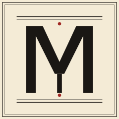
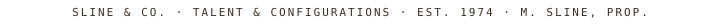
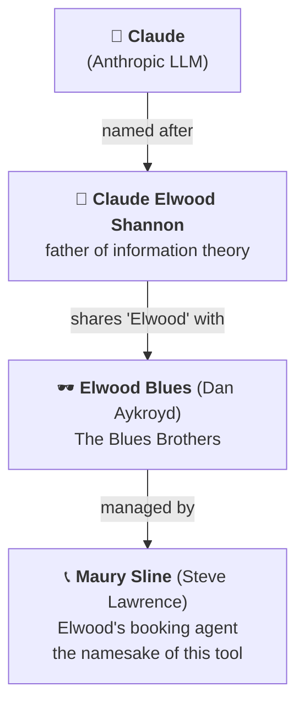

<p align="center">
  <picture>
    <source media="(prefers-color-scheme: dark)" srcset="docs/logo-dark.svg">
    
  </picture>
</p>

<h1 align="center">
  
</h1>

<p align="center">
  
</p>

<p align="center">
  <sub></sub>
</p>

---

Multi-host Claude Code configuration sync, mode isolation, and
learned-rule mining. Maury keeps `~/.claude/` consistent across machines,
isolates modes (home / work / per-client) at the trust-boundary
(one git repo per boundary, per-host SSH deploy keys) so personal
content cannot leak onto a work device, and periodically mines local
conversation transcripts to propose updates to your CLAUDE.md,
settings, hooks, and skills.

## Why maury exists

If you use Claude Code on more than one machine, you've felt the gap:
your CLAUDE.md is gold on your workstation, missing on the linux box,
half-applied on the work laptop. You add a useful skill on one machine
and forget it
elsewhere. The same correction surfaces in three transcripts because
nothing carries the lesson across.

The community has partial solutions:

- **[jean-claude](https://github.com/MikeVeerman/jean-claude)** does
  multi-host config sync — but only two hardcoded profiles
  (work/personal) and no learning loop.
- **[claude-diary](https://github.com/rlancemartin/claude-diary)** mines
  transcripts to propose CLAUDE.md updates — but single-host, no
  profiles, auto-appends instead of queuing for review.
- **[chezmoi + age](https://www.arun.blog/sync-claude-code-with-chezmoi-and-age/)**
  is the well-known DIY path — but it's a generic dotfile manager that
  knows nothing about Claude Code, profile boundaries, or learning.
- **Anthropic ships nothing** for personal multi-host config sync.
  `/doctor` is a plumbing health-check; auto-memory (v2.1.59+) is
  per-project and machine-local.

**The combination** — N user-defined modes + repo-level isolation +
local-only mining + rule-engine classification + cross-OS hook
portability + active in-session capture — is what no single tool does.
That's maury.

The project's purpose, captured as tenet #2 in
[`docs/tenets.md`](docs/tenets.md): *within a mode, Claude's
behavior should be identical across every host you use. Across
modes, differences must be explicit.* Drift within a mode is
a bug; differences between modes are a feature. (Tenet #1 is
"first, do no harm" — the operating principle for every state-
changing operation.)

## What it does

Three pillars:

1. **Sync** — `~/.claude/CLAUDE.md`, `settings.json`, agents, skills,
   keybindings, and hooks rendered from a versioned `base + mode chain
   + rules sublayers` composition. Cross-OS portable (macOS, Linux,
   FreeBSD).
2. **Mode isolation** — repo-per-trust-boundary architecture with
   per-host SSH deploy keys. A work host literally cannot read or push to
   personal-mode bytes; isolation is enforced server-side by the git
   provider's access control, not by client-side filtering.
3. **Learning** — local-only mining of `~/.claude/projects/*.jsonl`
   produces sanitized fragments classified by a deterministic, learnable
   rule engine. Proposals queue for review; reclassifications synthesize
   new rules.

## Teams

Maury was designed for individuals juggling multiple machines, but
the same architecture solves a problem teams have today: **how does
a team share a Claude Code setup, let engineers extend it, and keep
contributions flowing back through review without the curator
losing control?**

Anthropic has documented how their own teams use Claude Code
(search for "How Anthropic teams use Claude Code"): shared
CLAUDE.md content, skill libraries, hook conventions, and common
settings — all needing distribution to engineers who then extend
locally and (sometimes) contribute back. Today that's typically a
private dotfiles repo passed around by `git clone` + manual
install, with no enforced structure for who-can-write-what or how
contributions land.

Maury serves this directly:

- **Curator(s)** publish a team `rules` repo from a repo they hold
  `rw` on
  ([ADR-0037](docs/adr/0037-layer-taxonomy-and-repo-discovery.md),
  [ADR-0038](docs/adr/0038-precept-acquisition-model.md)).
- **Consumers** declare the team rules repo as a `rules` sublayer in
  their own mode marker, with `repo_mode: pr`
  ([ADR-0033](docs/adr/0033-pr-repo-mode.md)) — they read freely,
  but writes flow through pull requests for curator review.
- **Cross-boundary contributions** (a useful insight from a
  client-engagement mode that belongs in the team base) are routed
  via the promotion flow
  ([ADR-0009](docs/adr/0009-promotion-only-cross-boundary.md)),
  not direct pushes — an engineer holding `rw` on their own
  client-engagement repo still has only `ro` or `pr` on the shared
  team base, so the boundary holds.
- **Personal mode content** sits on top of team-published rules. An
  engineer's machine-specific overrides, secrets metadata, and
  per-host capability overrides stay personal and don't pollute
  the team repo.

So when the team's tech lead adds a new "review every commit
against this rubric" hook, it ships to every engineer's
`~/.claude/` on next sync. When an engineer hand-tunes a CLAUDE.md
fragment that turned out useful for the whole team, it's a one-line
`maury promote` to open a PR back. No hand-passing of dotfiles, no
ambient drift between team members.

For the concrete recipe — repo layout, manifest examples,
day-in-the-life walkthroughs for both curator and subscriber —
see [`docs/patterns/team-upstream.md`](docs/patterns/team-upstream.md).

## Why "Maury"?

Maury Sline is the talent agent in *The Blues Brothers* who books Jake
and Elwood's gigs — the closest thing to a manager the brothers have.
The metaphor maps cleanly: an agent who books your configs across town,
knows where everyone needs to be, and gets the band on stage.

The deeper thread is a four-generation family tree from the model down
to the tool that manages it:



So `claude → elwood → maury` traces the lineage from the model, through
information theory, through Chicago, to the tool that manages your
Claude config across hosts. The tagline writes itself.

## Status

Pre-v0.1, scaffolding stage. **For an honest snapshot of which
parts of maury actually work today vs. which are designed but
not yet implemented, see [`docs/status.md`](docs/status.md).**

For everything else:

- [`docs/elevator-pitch.md`](docs/elevator-pitch.md) — the
  two-minute flyby. **Start here if you're deciding whether
  maury is for you.**
- [`docs/quickstart.md`](docs/quickstart.md) — five-minute
  try-without-committing walkthrough against the bundled
  `base-template/` seed. **Start here if you want to see maury
  do something concrete before reading the design docs.**
- [`docs/concepts.md`](docs/concepts.md) — canonical definitions
  (nine core concepts + theoretical foundations).
  **Start here if you're new to maury.**
- [`docs/glossary.md`](docs/glossary.md) — quick-lookup glossary
  of every term maury uses, each linked to its longer explanation.
- [`docs/tenets.md`](docs/tenets.md) — the principles maury is
  built on.
- [`docs/workflow.md`](docs/workflow.md) — user-journey flowcharts
  (mermaid).
- [`docs/operations.md`](docs/operations.md) — per-command
  operational reference (mermaid).
- [`docs/claude-code-contract.md`](docs/claude-code-contract.md) —
  what maury depends on Claude Code doing, and how confident we
  are in each claim.
- [`docs/porting-to-new-os.md`](docs/porting-to-new-os.md) —
  primer for adding maury support on an OS beyond the three
  we currently exercise (macOS, Ubuntu, FreeBSD).
- [`docs/adr/`](docs/adr/) — architecture decisions, with each
  ADR citing the tenets it embodies and the Claude Code docs it
  references.

## Install

> The instructions below are the **developer / clone-from-source** flow
> for hacking on maury itself. Once published, the canonical user-install
> path will be `pipx install maury` (per
> [ADR-0018](docs/adr/0018-minimum-bootstrap-ux.md)) — but the package
> isn't on PyPI yet.

Requires Python ≥3.11 and [uv](https://docs.astral.sh/uv/).

```sh
# macOS
brew install uv

# Ubuntu
curl -LsSf https://astral.sh/uv/install.sh | sh

# FreeBSD (note: don't use `uv python install` — no FreeBSD CPython artifacts)
pkg install python311 uv
```

Then:

```sh
uv sync
uv run maury --help
```

## Architecture (one paragraph)

A host has one active mode. Renders compose `base` + the mode chain
(leaf to root) + `rules` sublayers attached at each level of the
chain, and write to `~/.claude/`. Each trust boundary is its own git
repo; per-host deploy keys grant scoped read/write. Hooks are written
against named actions (`notify`, `log_jsonl`, `run_script`) that the
render engine resolves to platform-specific commands using each
host's capability probe. Mining runs locally on every host and emits
structured fragments; classification is a pure rule engine over
`.meta/rules.yaml`; the user reviews proposals and reclassifications
synthesize new rules.

## Related work

Maury stands on shoulders. Credit:

- **[rlancemartin/claude-diary](https://github.com/rlancemartin/claude-diary)**
  (MIT) — design reference for the mining loop. The 2+/3+ pattern
  threshold and observe-reflect-retrieve cadence are from claude-diary.
  Maury reimplements rather than depends.
- **[MikeVeerman/jean-claude](https://github.com/MikeVeerman/jean-claude)**
  — sync UX reference. Confirmed the gap a mode-aware + learning tool fills.
- **[chezmoi](https://github.com/twpayne/chezmoi)** — generic dotfile
  manager whose host-detection model inspired the capability probe. Not
  used as a dependency; the multi-repo trust-boundary architecture is
  outside chezmoi's design center.

## License

MIT. See `LICENSE`.
