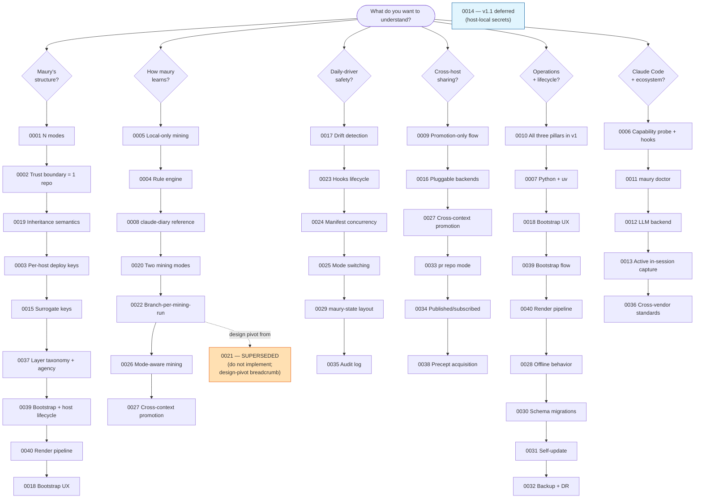

# maury — Architecture Decision Records

This directory contains every architecture decision record for
maury. Each ADR captures one architectural choice, the reasoning,
and the consequences. Decisions are numbered (`ADR-NNNN`) and
preserved as historical record — even superseded ones stay here
as breadcrumbs of the design's evolution.

ADRs follow a **MADR/Nygard hybrid** format with maury-specific
sections (Related tenets, Build-order placement, Followups,
Claude Code references). See
[`docs/process/adr-format.md`](../process/adr-format.md) for
the full spec.

---

## Reading paths

If you want to understand a specific topic, follow the path
below. Most readers will want to start with **"What is maury,
structurally?"** to ground the vocabulary first.

> ADR-0021 is preserved as a breadcrumb of the proposal-queue
> design pivot to ADR-0022; do not implement.
>
> ADR-0014 (host-local secrets) is v1.1-deferred. Design is in
> place; no implementation in v1.

---

## Reading paths — long form

### 1. "What is maury, structurally?"

The vocabulary and structural model: layer types, agency, distributed
manifest, render order. **Start here.**

| Read | About |
|---|---|
| [`0001`](0001-n-profiles.md) | N modes (not hardcoded home/work); single-parent inheritance |
| [`0002`](0002-repo-per-trust-boundary.md) | One git repo per trust boundary; **assumes git as the substrate** (see [`concepts.md`](../concepts.md#what-maury-assumes-about-its-substrate)) |
| [`0019`](0019-inheritance-semantics-refine-by-default.md) | How layers compose at render time (refinement-by-default, replacement-explicit) |
| [`0003`](0003-per-host-deploy-keys.md) | Per-host SSH deploy keys as the access-enforcement primitive |
| [`0015`](0015-surrogate-keys-for-hosts-and-profiles.md) | `host_<hex>` and `mode_<hex>` IDs (rename-safe identity) |
| [`0037`](0037-layer-taxonomy-and-repo-discovery.md) | Three layer types (base/mode/rules), agency concept, distributed manifest, render order — **the structural foundation** |
| [`0039`](0039-bootstrap-and-host-lifecycle.md) | Agency init, mode-scoped host identity, bootstrap flow |
| [`0040`](0040-render-pipeline.md) | Source file naming, full render target surface, LLM condensation — **what maury reads and writes** |
| [`0018`](0018-minimum-bootstrap-ux.md) | First-host onboarding flow (`maury init --from-dir` / `--from-tarball`) |

Companion docs: [`concepts.md`](../concepts.md) (the canonical
vocabulary reference), [`tenets.md`](../tenets.md) (the
principles ADRs cite).

### 2. "How does maury learn?"

The mining → proposal → review pipeline.

| Read | About |
|---|---|
| [`0005`](0005-local-only-mining.md) | Mining is local-only; raw transcripts never leave the host |
| [`0004`](0004-rule-engine-classification.md) | Smart-but-strict classification — rules are the learned artifact |
| [`0008`](0008-claude-diary-reference.md) | Reimplement mining; claude-diary as design reference |
| [`0020`](0020-two-mining-modes-bulk-and-incremental.md) | Bulk + incremental modes; four-state cross-reference taxonomy |
| [`0022`](0022-branch-per-mining-run.md) | Mining run = branch; finding = commit; rationale in trailers; **supersedes 0021** |
| [`0026`](0026-profile-aware-mining.md) | Session-to-profile linkage; bucketize findings by source profile |
| [`0027`](0027-cross-context-promotion-via-shared-root.md) | Promotion graph IS the inheritance graph; only ancestor-direction promotion |

Superseded breadcrumb: [`0021`](0021-promotion-changelog.md)
(do not implement).

### 3. "How is the daily-driver loop safe?"

`maury sync` against a real `~/.claude/` without losing user
hand-edits or silently diverging from peers.

| Read | About |
|---|---|
| [`0017`](0017-drift-detection-and-reconciliation.md) | Hand-edits as first-class input; `last-render.json`; reconcile menu |
| [`0023`](0023-hook-installation-and-tool-resolution.md) | Hook ownership marker scheme; capability-driven tool resolution |
| [`0024`](0024-manifest-concurrency-inclusive-merge.md) | Inclusive structured merge; never silently drop user state |
| [`0025`](0025-profile-switching-session-safeguards.md) | Profile switch refuses on active session / drift / casual `--force` |
| [`0029`](0029-maury-state-layout-contract.md) | Single canonical contract for `~/.claude/maury-state/` |
| [`0035`](0035-audit-log.md) | The Phase 10 audit log — every state-changing op recorded |

### 4. "How does maury share content across hosts and people?"

Cross-host coordination, cross-trust-boundary promotion, and
team-published rules repos.

| Read | About |
|---|---|
| [`0009`](0009-promotion-only-cross-boundary.md) | Cross-trust-boundary promotion mechanics (proposal queue, curator review) |
| [`0016`](0016-pluggable-repo-backends.md) | Per-repo backend adapter; git-substrate-only post-amendment |
| [`0027`](0027-cross-context-promotion-via-shared-root.md) | Inheritance graph constraint on promotion (no lateral cross-mode) |
| [`0033`](0033-pr-repo-mode.md) | `pr` repo mode — third value alongside `ro`/`rw` |
| [`0034`](0034-published-subscribed-profiles.md) | Curator publishes; engineers subscribe; contribute back via PR |
| [`0038`](0038-precept-acquisition-model.md) | Rules acquisition, governance metadata, advisory lifecycle, semver versioning — **the canonical shared-rules reference** |

Companion: [`docs/patterns/team-upstream.md`](../patterns/team-upstream.md)
(concrete recipe).

### 5. "How does maury operate (start, run, recover)?"

The lifecycle of a maury installation.

| Read | About |
|---|---|
| [`0010`](0010-all-three-pillars-v1.md) | Scope decision: all three pillars (sync + isolation + learning) ship in v1 |
| [`0007`](0007-python-with-uv.md) | Python + `uv` for tooling; works on FreeBSD too |
| [`0018`](0018-minimum-bootstrap-ux.md) | First-host onboarding; air-gap path via `--from-tarball` |
| [`0039`](0039-bootstrap-and-host-lifecycle.md) | Eight-step bootstrap flow, mode change process, sync traversal scope |
| [`0040`](0040-render-pipeline.md) | `maury sync` behavior, `maury agency validate`, LLM condensation pass |
| [`0028`](0028-offline-behavior.md) | Per-command offline policy; opportunistic detection (no pre-probe) |
| [`0030`](0030-manifest-schema-migrations.md) | Per-version upgrade scripts; refuse newer-than-supported manifests |
| [`0031`](0031-self-update-path.md) | Delegate self-upgrade to pipx; soft stale-version warning |
| [`0032`](0032-backup-and-disaster-recovery.md) | `maury backup` / `maury restore` for the irreplaceable state |

### 6. "How does maury integrate with Claude Code and the broader ecosystem?"

Claude Code capability probing, active in-session capture, quality rubrics,
and cross-vendor standards. For the render target surface (what ends up in
`~/.claude/`), see ADR-0040 in path 1.

| Read | About |
|---|---|
| [`0006`](0006-capability-probe-hook-abstraction.md) | Per-host capability probe; hooks against named actions |
| [`0011`](0011-anthropic-rubric-integration.md) | `maury doctor` evaluates CLAUDE.md against Anthropic's best-practices rubric |
| [`0012`](0012-llm-backend.md) | LLM backend abstraction (`claude -p` default; SDK opt-in) |
| [`0013`](0013-active-in-session-capture.md) | Active capture: skill + hook + slash command for in-session staging |
| [`0036`](0036-open-standards-alignment.md) | Cross-vendor open-standards alignment (Agent Skills, AGENTS.md, MCP, AAF) |

Companion: [`docs/claude-code-contract.md`](../claude-code-contract.md)
(every Claude Code behavior maury depends on, with verification
status).

---

## Full index by number

<!-- Maintain in numeric order. One line per ADR. -->

- [`0000`](0000-template.md) — ADR template (MADR/Nygard hybrid)
- [`0001`](0001-n-profiles.md) — N profiles, not a hardcoded {home, work} pair
- [`0002`](0002-repo-per-trust-boundary.md) — Repo per trust boundary, not per profile
- [`0003`](0003-per-host-deploy-keys.md) — Per-host deploy keys, not account collaboration
- [`0004`](0004-rule-engine-classification.md) — Smart-but-strict classification: rules as learned artifact
- [`0005`](0005-local-only-mining.md) — Local-only mining, never cross-host transcript pull
- [`0006`](0006-capability-probe-hook-abstraction.md) — Capability probe + hook abstraction
- [`0007`](0007-python-with-uv.md) — Python with uv, including FreeBSD
- [`0008`](0008-claude-diary-reference.md) — Reimplement mining; claude-diary as design reference
- [`0009`](0009-promotion-only-cross-boundary.md) — Promotion-only flow for cross-boundary updates
- [`0010`](0010-all-three-pillars-v1.md) — All three pillars in v1
- [`0011`](0011-anthropic-rubric-integration.md) — Anthropic rubric integration (`maury doctor`)
- [`0012`](0012-llm-backend.md) — LLM backend (`claude -p` default, SDK opt-in)
- [`0013`](0013-active-in-session-capture.md) — Active in-session capture
- [`0014`](0014-host-local-secrets-with-metadata-sync.md) — Host-local secrets with metadata sync (v1.1)
- [`0015`](0015-surrogate-keys-for-hosts-and-profiles.md) — Surrogate keys for hosts and profiles
- [`0016`](0016-pluggable-repo-backends.md) — Pluggable repo backends — separate trust boundary from transport
- [`0017`](0017-drift-detection-and-reconciliation.md) — Hand-edits as first-class input — drift detection and reconciliation
- [`0018`](0018-minimum-bootstrap-ux.md) — Minimum bootstrap UX
- [`0019`](0019-inheritance-semantics-refine-by-default.md) — Inheritance semantics — refine by default, replace explicitly
- [`0020`](0020-two-mining-modes-bulk-and-incremental.md) — Two mining modes — bulk and incremental
- [`0021`](0021-promotion-changelog.md) — **SUPERSEDED by 0022** — Promotion changelog (do not implement)
- [`0022`](0022-branch-per-mining-run.md) — Branch-per-mining-run with commit-message-as-proposal
- [`0023`](0023-hook-installation-and-tool-resolution.md) — Hook installation lifecycle and capability-driven tool resolution
- [`0024`](0024-manifest-concurrency-inclusive-merge.md) — Manifest concurrency and inclusive structured merge
- [`0025`](0025-profile-switching-session-safeguards.md) — Profile switching with session-boundary safeguards
- [`0026`](0026-profile-aware-mining.md) — Profile-aware mining
- [`0027`](0027-cross-context-promotion-via-shared-root.md) — Cross-context promotion via shared inheritance root
- [`0028`](0028-offline-behavior.md) — Offline behavior
- [`0029`](0029-maury-state-layout-contract.md) — `~/.claude/maury-state/` layout contract
- [`0030`](0030-manifest-schema-migrations.md) — Manifest schema migrations
- [`0031`](0031-self-update-path.md) — Self-update path
- [`0032`](0032-backup-and-disaster-recovery.md) — Backup and disaster recovery
- [`0033`](0033-pr-repo-mode.md) — `pr` repo mode (gap K part 1)
- [`0034`](0034-published-subscribed-profiles.md) — Published/subscribed profiles (gap K part 2)
- [`0035`](0035-audit-log.md) — Audit log (Phase 10)
- [`0036`](0036-open-standards-alignment.md) — Cross-vendor open-standards alignment
- [`0037`](0037-layer-taxonomy-and-repo-discovery.md) — Layer taxonomy (base/mode/rules), repo marker file, render order, distributed manifest
- [`0038`](0038-precept-acquisition-model.md) — Rules/precept acquisition, advisory lifecycle, semver versioning, `maury repo init`
- [`0039`](0039-bootstrap-and-host-lifecycle.md) — Bootstrap flow, mode-scoped host identity, agency init, mode change process
- [`0040`](0040-render-pipeline.md) — Render pipeline: source file naming, full target surface, LLM condensation, agent routing guidance, `maury agency validate`

---

## Cross-references

- **For per-Claude-Code-behavior verification:**
  [`docs/claude-code-contract.md`](../claude-code-contract.md)
  — every Claude Code behavior maury depends on, with
  verification status, plus
  [`docs/claude-code-snapshots/`](../claude-code-snapshots/).
- **For maury concepts and vocabulary:**
  [`docs/concepts.md`](../concepts.md) — start here if you're
  new to maury.
- **For user-facing flows:**
  [`docs/workflow.md`](../workflow.md) (the user journey),
  [`docs/operations.md`](../operations.md) (per-command
  flowcharts).
- **For implementation status:**
  [`docs/status.md`](../status.md) — what works today vs what's
  designed but not yet implemented.
- **For tenets ADRs cite:**
  [`docs/tenets.md`](../tenets.md).
