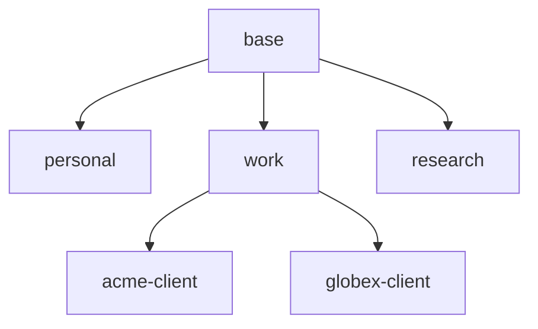

# maury — concepts and definitions

This is the canonical reference for the terms maury's docs use.
ADRs document *decisions*; this file documents the *concepts*
those decisions operate on. When a term is used loosely in
conversation or in an ADR, this file is what it's referring to.

**Reading order:**

1. **[The mental model](#the-mental-model)** below — start here if
   you've never used maury. ~3 minutes. Plain-language analogies,
   no jargon.
2. **[The six core concepts](#the-six-core-concepts)** — formal
   definitions. Reach for these when you need precision (writing
   an ADR, debugging a render, auditing a safety property).
3. **[Theoretical foundations](#theoretical-foundations)** — the
   established CS/IT frameworks maury composes. Reach for these
   when you want to ground a design discussion in literature
   instead of one-off arguments.

---

## The mental model

If you've ever managed dotfiles across multiple machines
(`.bashrc`, `.vimrc`, etc.) you already know maury's premise.
**Maury is the richer version of that, specialized for your
Claude Code config (`~/.claude/`), with two extra ideas: profiles
and inheritance.**

Two analogies, both useful:

### Analogy 1 — outfits in a wardrobe

Imagine your `~/.claude/` directory is your **outfit for the day**.

The pieces of an outfit live in **drawers**. Each drawer is one
profile (`personal`, `work`, `acme-client`, …). Some pieces go
with everything: your watch, your favorite belt. You keep those
in a **shared drawer** (the `base` profile) so you don't have to
copy them into every other drawer.

When you "get dressed" on a given machine — that's a **render** —
maury opens the shared drawer first, then the profile-specific
drawer for whichever context you've chosen, then adds any host-
specific tweaks (a coat if it's cold on this particular machine).

Drawers live in **locked cabinets**. A cabinet is a *trust
boundary* (one git repo). One cabinet can hold multiple drawers
if you trust those drawers' contents to coexist (a `consulting`
cabinet might hold both `acme-client` and `globex-client`
drawers). Each cabinet has its own lock; only some hosts have
keys to a given cabinet. Your work laptop can't reach into the
personal cabinet because it doesn't have that cabinet's key —
even though it has keys to its own work cabinet.

> Cleanly: **drawer = profile; cabinet = trust boundary (one git
> repo); cabinets contain drawers.** Multiple drawers per cabinet
> is the norm, not the exception.

### Analogy 2 — config files with composition

If you'd rather think in code: maury's `base` profile is like
your shared `~/.bashrc.common`, sourced everywhere. A specific
profile (`work`, `personal`) is like a `~/.bashrc.work` that
extends the common one. The host overlay is the per-machine
tweak.

The thing that's NEW vs dotfile management:

- **Profile inheritance** — a profile can extend another. So
  `acme-client` extends `work` extends `base`, and rendering
  composes all three. (Like CSS classes inheriting from base
  styles, or Docker images layered on a base image.)
- **Trust boundaries** — each profile lives in a git repo with
  per-host SSH deploy keys. The work laptop literally cannot
  fetch the bytes of personal content. Privacy is enforced
  server-side, not by client-side filtering.
- **Active profile** — at any moment a host is "in" exactly one
  profile. Switching is deliberate (and safeguarded — see
  [ADR-0025](adr/0025-profile-switching-session-safeguards.md)).

### One-line summary of each term

| Term | Plain-language gist |
|---|---|
| **Profile** | A named context (e.g., `personal`, `work`, `acme-client`) — one drawer in your wardrobe |
| **Trust boundary** | A locked cabinet (one git repo) — only some hosts have the key. One cabinet can hold multiple drawers |
| **Inheritance** | A profile can build on another's pieces (`acme-client` builds on `work` builds on `base`) |
| **Layer** | One drawer's contribution at render time |
| **Active profile** | Which context you're "wearing" right now on this machine |
| **Render** | Composing all the layers into your `~/.claude/` |
| **Promotion** | Moving a piece from one drawer to a more-shared drawer (e.g., a `work` finding → `base`) |

That's the whole model. Everything below is precision —
necessary if you're writing an ADR or auditing a safety property,
skippable on first read. (The wardrobe analogy is intentionally
loose; the formal sections distinguish profile-vs-trust-boundary
in ways the analogy blurs, so come back here if anything is
unclear later.)

---

## The six core concepts

These six terms are load-bearing across every ADR. They are not
synonymous with each other — and they are not synonymous with
Claude Code's terms of art (which sometimes use the same words to
mean different things).

### 1. Profile

A **profile** is a user-defined namespace of configuration content
— a CLAUDE.md fragment, skills, hooks, settings, and rules — that
applies when a host is "in" that profile.

Profiles are registered in `.meta/manifest.json`. They have:

- A surrogate ID (`profile_<32 hex>`, per [ADR-0015](adr/0015-surrogate-keys-for-hosts-and-profiles.md))
- A human-friendly name (`personal`, `work`, `acme-client`, …)
- An optional single parent profile via `extends:` (see
  [Inheritance](#3-inheritance) below)

Profiles are user-defined and unbounded. There's nothing in
maury's schema that hardcodes "personal" or "work" — those are
just names you happened to register. Per
[ADR-0001](adr/0001-n-profiles.md). The "context the user is
working in right now" framing is in [§5 Active profile](#5-active-profile);
this section defines what a profile *is* structurally.

### 2. Trust boundary

A **trust boundary** is the unit of read/write access. One trust
boundary = one git repo. Per
[ADR-0002](adr/0002-repo-per-trust-boundary.md).

Multiple profiles can live inside one trust boundary if you trust
those profiles to see each other's content. Crossing a trust
boundary requires a separate repo + separate deploy keys per host
(per [ADR-0003](adr/0003-per-host-deploy-keys.md)).

> **Profile ≠ trust boundary.** A profile is a *content namespace*;
> a trust boundary is an *access scope*. The `personal` and `work`
> profiles are typically in *different* repos (different trust
> boundaries) because you don't want the work-laptop fetching
> personal content. But the `acme-client` and `globex-client`
> profiles might share one repo (one trust boundary called
> "consulting") if you trust those clients' contexts to coexist.

### 3. Inheritance

**Inheritance** is the *extends* relationship between profiles.
Profile A *extends* profile B means: when rendering for A, base +
B's content + A's content all compose into the final
`~/.claude/`. A is the *child*, B is the *parent*.

Two structural rules:

- **Single-parent only.** A profile extends exactly zero or one
  parents. No diamond inheritance. (Per
  [ADR-0001](adr/0001-n-profiles.md).)
- **Acyclic.** The extends chain must terminate; no cycles. The
  manifest validator enforces this.

This means the inheritance graph is a **forest of trees** rooted
at the implicit `base` (every render starts from `base` even if a
profile doesn't explicitly extend it).

Concrete example:

In this tree:

- `personal` extends `base` directly.
- `work` extends `base` directly.
- `acme-client` extends `work` extends `base` (chain length 2).
- `globex-client` extends `work` extends `base` (chain length 2).
- `research` extends `base` directly.

Reading the chain "root to leaf" for `acme-client`: `base → work
→ acme-client`. The render engine walks this chain and composes
content according to [ADR-0019](adr/0019-inheritance-semantics-refine-by-default.md)'s
refinement-by-default semantics.

**The inheritance graph IS the trust graph for cross-context
promotion.** A finding in `acme-client` can be promoted to:

- `acme-client` itself (no promotion needed; just commit there)
- `work` (its parent — flows to `acme-client` AND `globex-client`
  via inheritance)
- `base` (the root — flows to every descendant)

A finding in `acme-client` CANNOT be promoted directly to
`globex-client` even though they share a parent — you have to go
through `work` (the shared parent) or `base` (the shared root).

> **What ADR-0009 already covers vs. what planned ADR-0027 will
> add:** [ADR-0009](adr/0009-promotion-only-cross-boundary.md)
> establishes the *cross-trust-boundary promotion mechanics* —
> the proposal queue, curator review, audit trail. Planned
> ADR-0027 adds the *inheritance-graph constraint* on top:
> promotion can only flow along extends edges (or shared-root
> paths), so lateral cross-profile promotion is forbidden by the
> graph itself, not just by the curator's discretion. The two
> compose: ADR-0009 says "how" promotion happens; ADR-0027 will
> say "where in the graph it's permitted to happen."

### 4. Layer

A **layer** is one source of content that the render engine
composes into the final `~/.claude/`. There are three kinds:

- **Base layer** — the implicit root. Every render includes base.
- **Profile chain layers** — each profile in the inheritance
  chain, root-to-leaf. For `acme-client` above: `work`, then
  `acme-client`.
- **Host overlay layer** — host-specific content under
  `profiles/<active-profile>/hosts/<host>/`. Per-host capabilities,
  per-host hand-managed paths, etc.

Render order is always `base → profile chain (root → leaf) → host
overlay`. Refinement and replacement semantics per
[ADR-0019](adr/0019-inheritance-semantics-refine-by-default.md).

> **Profile ≠ layer.** A profile *contributes a layer* during
> render. The same profile can contribute different layers on
> different hosts (because each host has its own host overlay
> directory under that profile).

### 5. Active profile

A host has, at any moment, exactly **one active profile.** The
active profile is *the leaf* of the inheritance chain — the
specific named profile the host has been bound to. It determines
which full inheritance chain (leaf-to-root) renders into the
host's `~/.claude/`.

> **Active profile ≠ context.** The active profile is the leaf
> only (one named profile). "Context" — when used in maury docs
> as a term-of-art — means *active profile PLUS its full
> inheritance chain*. They appear adjacent in the glossary
> because they're related, but they're not synonyms. When
> someone says "the work context," they mean `work` plus
> everything `work` extends from (typically `base`); when they
> say "the active profile is `work`," they mean just `work`.

A host's active profile is set by:

- `maury init` (initial assignment).
- `maury profile use <name>` (with safeguards per
  [ADR-0025](adr/0025-profile-switching-session-safeguards.md)).
- Manual edit of the host's manifest entry (with all the same
  validation as the above).

If `lock: true` is set on the host's manifest entry,
`maury profile use` refuses to change the active profile (per
[ADR-0001](adr/0001-n-profiles.md)).

> **"Context" in maury usually means "active profile + its
> inheritance chain."** When someone says *"this should apply to
> my work context,"* they mean *"this should apply to the active
> profile `work` and any profile that extends `work`."*

### 6. Inheritance access mode

> *Inheritance tells you what content flows; access mode tells
> you who can change the source.*

Every child-forebearer relationship in maury has one of three
**access modes** — describing what the child can do to the
forebearer's *canonical* state (not the rendered output, which
is always read-only). The three modes are universal vocabulary
that ADRs reach for when describing contribution flows.

| Mode | Read | Write | Used when |
|---|---|---|---|
| **`ro`** | yes | none | Default. Child consumes parent content; no path to modify the parent's source directly from this host. |
| **`pr`** *(planned)* | yes | via pull request, requires curator approval | Child can submit changes for review; curator merges. **Not yet expressible in the manifest schema** — ADR-0003 currently defines only `ro`/`rw`. The `pr` mode lands in a planned gap-K ADR alongside the workflow tooling. Mechanically, `pr` is a workflow layered on top of `ro` deploy-key access plus a side channel (e.g., GitHub PR via `gh`); the mode value just makes the contract explicit in the manifest. |
| **`rw`** | yes | direct push | Full trust. Curator hosts have this on the repos they maintain. |

The mode is a property of the **access path** — specifically the
deploy key the child's host holds for the forebearer's source
repo (per [ADR-0003](adr/0003-per-host-deploy-keys.md), which
today enumerates `ro` and `rw`). It is not a property of the
abstract relationship between two profiles.

**When child and parent live in the same repo** (e.g., `work`
and `acme-client` both in `maury-work`), one mode applies — the
host's deploy-key access on `maury-work` determines whether the
child can modify the parent's canonical content directly.

**When child and parent live in different repos** (the trust-
boundary-spanning case from [§2](#2-trust-boundary)), multiple
modes are involved — one per repo. The
[cross-boundary promotion flow (ADR-0009)](adr/0009-promotion-only-cross-boundary.md)
is the *default* contribution mechanism for cross-trust-boundary
content even when one of the involved hosts has `rw` somewhere
in the chain — promotion-and-review prevents accidental cross-
boundary writes regardless of access. When access is `ro`-only
on both sides, cross-boundary promotion is the **only**
mechanism available.

This three-mode framing is **orthogonal to content composition**
([ADR-0019](adr/0019-inheritance-semantics-refine-by-default.md)
covers refinement-vs-replacement at render time):

- *Content composition* = how parent and child layers merge into
  the final rendered output.
- *Access mode* = what the child can do to the parent's canonical
  source if it wants to contribute changes back upward.

Both axes are always in play. The render walks the inheritance
chain regardless of mode (because rendering only reads); the
contribution flow depends entirely on mode.

---

## Two terms maury intentionally avoids re-defining

### "Context" (Claude Code's usage)

Claude Code uses "context" to mean **the working memory of one
session** — the prompt + conversation history + tool-use chain
that the assistant has loaded. Maury's "context" (defined in
[§5 Active profile](#5-active-profile)) is unrelated.

To keep them apart, maury docs say **"session context"** or
**"conversation context"** when referring to Claude Code's
session memory; **"context"** alone always means
*active profile + inheritance chain* per §5.

Per [`cc-contract:fresh-session-context`](claude-code-contract.md#cc-contractfresh-session-context),
Claude Code's session context is fresh on every new invocation
(unless `--resume` is used). Maury's profile context is set at
`maury init` and changed only by `maury profile use`.

### "Inheritance" (object-oriented usage)

Maury's profile inheritance is a *content composition* mechanism
(layers compose at render time). It is NOT object-oriented
inheritance — there are no methods, no polymorphism, no virtual
dispatch. The only thing that "happens" with inheritance is that
the render engine walks the chain and composes layered content.

If you've used dotfile managers like chezmoi, maury's inheritance
is closer to that mental model than to Java's `class A extends B`.

---

## How the concepts compose: a worked example

Suppose the project owner (a freelancer) has:

- Two hosts: `workstation` (their personal Mac) and `work-laptop`
  (a client-issued machine for ACME).
- Three profiles: `personal`, `work`, `acme-client`. Inheritance:
  `personal` extends `base`; `work` extends `base`; `acme-client`
  extends `work`.
- **Three trust boundaries (per [ADR-0002](adr/0002-repo-per-trust-boundary.md)):**
  - `maury-base` — holds base content only. Both hosts have read
    access; only the curator host has write.
  - `maury-personal` — holds the `personal` profile. Only
    `workstation` has access.
  - `maury-work` — holds `work` and `acme-client`. Only
    `work-laptop` has rw access; `workstation` has rw too if it
    serves as curator.

Base lives in its own repo so `work-laptop` can consume it
without ever fetching the bytes of any `personal` content.

Active profile per host:

- `workstation`: active profile is `personal`. Renders by
  composing layers from `maury-base` (base) and `maury-personal`
  (personal + workstation overlay).
- `work-laptop`: active profile is `acme-client`. Renders by
  composing layers from `maury-base` (base) and `maury-work`
  (work + acme-client + work-laptop overlay).

If the freelancer learns a useful pattern while working as
`acme-client` and wants it to apply to all client work:

- They mark it for promotion to `work` (parent of `acme-client`).
- After review, the rule lands in `maury-work`'s `work` profile.
- Next sync, both `acme-client` and any future sibling client
  profile (e.g., `globex-client`) inherit it.

If the same pattern should apply to personal projects too:

- They'd need to promote it to `base` (the shared root, which
  lives in `maury-base`).
- But the `work-laptop` doesn't have write access to `maury-base`.
  So the promotion happens in two steps:
  - Step 1: a finding-shaped commit lands in `maury-work`'s
    review queue, tagged for promotion to `base`.
  - Step 2: a curator host with write access to both `maury-work`
    (read) and `maury-base` (write) cross-promotes it. Per
    [ADR-0009](adr/0009-promotion-only-cross-boundary.md).

---

## Theoretical foundations

Maury's model is not invented from scratch. It composes four
well-established frameworks. Naming them gives ADR authors
precise vocabulary to reach for and grounds maury's safety
properties in literature instead of one-off arguments.

### Mandatory access control (Bell-LaPadula, 1973)

[Bell-LaPadula][bell-lapadula] established the formal model of
**security labels** on data and **clearances** on subjects. The
governing rules are *no read up* (a subject cannot read data above
its clearance) and *no write down* (a subject cannot write data
below its level). Labels form a partial-order **lattice**.

**Maury maps to this:**

| Bell-LaPadula | Maury |
|---|---|
| Security label | Trust boundary (one repo) |
| Subject clearance | Per-host deploy keys ([ADR-0003](adr/0003-per-host-deploy-keys.md)) |
| Lattice | The repo-access graph across hosts |
| No read up | A work-laptop cannot fetch personal-context bytes |
| Controlled write up | Cross-trust-boundary promotion via curator review |

We are essentially implementing a simplified MAC system
specialized for personal + small-team Claude Code config. When
debating safety properties, we can audit them against this
literature instead of inventing arguments.

### Lexical scoping (Strachey, 1967)

[Lexical scoping][lexical-scoping] is the rule that inner scopes
see outer scopes' bindings; outer scopes don't see inner. Lookups
walk the chain outward. Maury's render-time inheritance is exactly
this:

- Inner scope (`acme-client`) sees outer (`work`) which sees
  outermost (`base`).
- `base` cannot see `work`'s additions; `work` cannot see
  `acme-client`'s.
- "Render walks the chain root-to-leaf, later wins" = lexical-
  scope shadowing.

This is a more precise mental model than "inheritance" for what
maury does. There are no methods, no polymorphism, no virtual
dispatch — just *content composition by walking a chain of scopes*.

### Non-interference (Goguen & Meseguer, 1982)

[Goguen-Meseguer non-interference][goguen-meseguer] is the
formal property that high-security inputs do not affect low-
security outputs. Inputs at level H must be unobservable at
level L.

**Maury's promotion-only flow IS a non-interference property.**
Personal-context content has zero effect on `work-laptop`'s render
output, because `work-laptop` literally cannot fetch the bytes
(different trust boundary, no key per ADR-0003). The only path
personal → work is: personal mining → curator review → explicit
promotion to base → base flows to work via inheritance. Each
step is observable and gated by a curator.

When someone asks "but can personal content leak to the work
laptop?" the answer is: *non-interference with curator-mediated
upward flow* — a known property with known proofs.

### CSS cascading (Lie & Bos, 1996)

[CSS][css-spec] combines inheritance (children inherit parent
properties) with cascading (later rules override earlier).
Specificity rules adjudicate conflicts.

[ADR-0019](adr/0019-inheritance-semantics-refine-by-default.md)'s
"refinement by default, replacement explicitly" is essentially
CSS's cascade with one specificity-ish twist (per-content-type
defaults). For users who've authored CSS, **"think of profiles as
nested CSS scopes"** is the closest single-sentence explanation
that doesn't import OO baggage.

### Two frameworks maury deliberately avoids citing

- **Object-oriented inheritance (Java/C++).** Brings methods,
  polymorphism, virtual dispatch — none of which maury has.
  Using "inheritance" loosely is fine; using it as in
  `class A extends B` causes more confusion than clarity.
- **Prototype-based inheritance (JavaScript, Self).** Closer to
  maury mechanically (single-parent chain, lookup walks chain),
  but the vocabulary (delegation, prototype) imports a different
  mental model than the security/composition story we want.

[bell-lapadula]: https://en.wikipedia.org/wiki/Bell%E2%80%93LaPadula_model
[lexical-scoping]: https://en.wikipedia.org/wiki/Scope_(computer_science)#Lexical_scope
[goguen-meseguer]: https://en.wikipedia.org/wiki/Non-interference_(security)
[css-spec]: https://www.w3.org/TR/css-cascade/

---

## Quick glossary

| Term | Means | See |
|---|---|---|
| **Profile** | Named namespace of configuration content | [§1](#1-profile), [ADR-0001](adr/0001-n-profiles.md) |
| **Trust boundary** | One git repo = one access scope | [§2](#2-trust-boundary), [ADR-0002](adr/0002-repo-per-trust-boundary.md) |
| **Inheritance** | Extends relationship between profiles | [§3](#3-inheritance), [ADR-0019](adr/0019-inheritance-semantics-refine-by-default.md) |
| **Inheritance chain** | The root-to-leaf path through extends | [§3](#3-inheritance) |
| **Layer** | One source of content composed at render | [§4](#4-layer) |
| **Host overlay** | Per-host slice of a profile's content | [§4](#4-layer) |
| **Active profile** | The one profile a host is currently in | [§5](#5-active-profile) |
| **Inheritance access mode** | What a child can do to a forebearer's canonical state: `ro` / `pr` / `rw` | [§6](#6-inheritance-access-mode), planned gap-K ADR (pr mode) |
| **`maury-status` skill** | Claude-invokable mid-session affordance that surfaces maury's view of host state (active profile, drift, pending captures/proposals, active sessions) | [ADR-0017 §"The `maury-status` skill"](adr/0017-drift-detection-and-reconciliation.md#the-maury-status-skill) |
| **Context** | Active profile + its inheritance chain | [§5](#5-active-profile) (NOT Claude Code's "session context") |
| **Render** | Compose all layers → write to `~/.claude/` | [ADR-0019](adr/0019-inheritance-semantics-refine-by-default.md) |
| **Refinement** | Default merge semantics: child adds to parent | [ADR-0019](adr/0019-inheritance-semantics-refine-by-default.md) |
| **Replacement** | Explicit override semantics: child replaces parent | [ADR-0019](adr/0019-inheritance-semantics-refine-by-default.md) |
| **Promotion** | Move content up the inheritance graph (toward base) | [ADR-0009](adr/0009-promotion-only-cross-boundary.md), ADR-0027 (planned) |
| **Cross-trust-boundary promotion** | Promotion that crosses repos (e.g., work → base when base lives in a separate repo) — requires a curator host with write access to both repos | [ADR-0009](adr/0009-promotion-only-cross-boundary.md) |
| **Curator** | A user (and the host they operate on) with write access to a higher-trust repo. Acts as the gate for cross-trust-boundary promotion review | [ADR-0009](adr/0009-promotion-only-cross-boundary.md) |
| **Provenance** | The record of where rendered content came from (which layer contributed which lines) — surfaced as a comment block at the top of every rendered file | [ADR-0019](adr/0019-inheritance-semantics-refine-by-default.md), Tenet 7 |
| **Manifest** | `.meta/manifest.json` — the source of truth for hosts/profiles/repos. Schema spine in [ADR-0015](adr/0015-surrogate-keys-for-hosts-and-profiles.md); specific fields extended by [ADR-0001](adr/0001-n-profiles.md) (profiles, lock), [ADR-0002](adr/0002-repo-per-trust-boundary.md) (repos), [ADR-0003](adr/0003-per-host-deploy-keys.md) (deploy-key paths), [ADR-0014](adr/0014-host-local-secrets-with-metadata-sync.md) (secrets metadata, v1.1), [ADR-0016](adr/0016-pluggable-repo-backends.md) (backend field), [ADR-0024](adr/0024-manifest-concurrency-inclusive-merge.md) (concurrency mechanics) | [ADR-0015](adr/0015-surrogate-keys-for-hosts-and-profiles.md) |

If a term shows up in an ADR and isn't here, that's a doc bug —
file it as a finding for the next ADR landscape audit.
