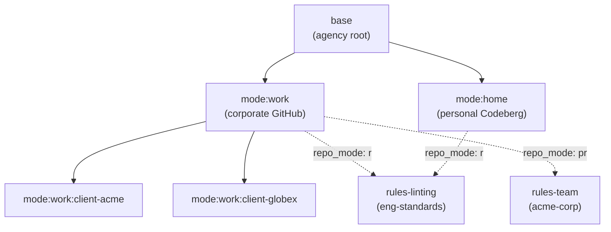
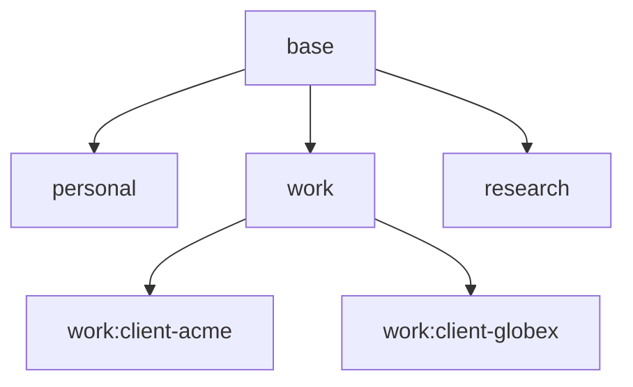

# maury — concepts and definitions

This is the canonical reference for the terms maury's docs use.
ADRs document *decisions*; this file documents the *concepts*
those decisions operate on. When a term is used loosely in
conversation or in an ADR, this file is what it's referring to.

**Reading order:**

1. **[The mental model](#the-mental-model)** below — start here if
   you've never used maury. ~3 minutes. Plain-language analogies,
   no jargon.
2. **[The core concepts](#the-core-concepts)** — formal
   definitions. Reach for these when you need precision (writing
   an ADR, debugging a render, auditing a safety property).
3. **[Theoretical foundations](#theoretical-foundations)** — the
   established CS/IT frameworks maury composes. Reach for these
   when you want to ground a design discussion in literature
   instead of one-off arguments.

For an alphabetical quick-lookup of every term (with cross-refs
back into this doc and to the relevant ADRs), see
[`docs/glossary.md`](glossary.md).

## Table of contents

- [The mental model](#the-mental-model)
  - [Analogy 1 — outfits, lockers, and vending machines](#analogy-1--outfits-lockers-and-vending-machines)
  - [Analogy 2 — config files with composition](#analogy-2--config-files-with-composition)
  - [One-line summary of each term](#one-line-summary-of-each-term)
- [The core concepts](#the-core-concepts)
  - [1. Agency](#1-agency)
  - [2. Layer types](#2-layer-types)
  - [3. Sublayers](#3-sublayers)
  - [4. Trust boundary](#4-trust-boundary)
  - [5. Mode tree and inheritance](#5-mode-tree-and-inheritance)
  - [6. Layer (at render time)](#6-layer-at-render-time)
  - [7. Active mode](#7-active-mode)
  - [8. Mode-scoped host identity](#8-mode-scoped-host-identity)
  - [9. `repo_mode` (access subtype)](#9-repo_mode-access-subtype)
  - [10. Drift and reconcile](#10-drift-and-reconcile)
- [What maury assumes about its substrate](#what-maury-assumes-about-its-substrate)
- [Two terms maury intentionally avoids re-defining](#two-terms-maury-intentionally-avoids-re-defining)
- [How the concepts compose: a worked example](#how-the-concepts-compose-a-worked-example)
- [Theoretical foundations](#theoretical-foundations)
- [Quick glossary](#quick-glossary)

---

## The mental model

If you've ever managed dotfiles across multiple machines
(`.bashrc`, `.vimrc`, etc.) you already know maury's premise.
**Maury is the richer version of that, specialized for your
Claude Code config (`~/.claude/`), with two extra ideas: modes
and layered composition.**

Two analogies, both useful:

### Analogy 1 — outfits, lockers, and vending machines

Imagine your `~/.claude/` directory is your **outfit for the day**.

Every outfit has the same **uniform underneath** — your t-shirt
and jeans. That's the `base` layer: it travels with you to
every location, and you wear it under everything else. Universal
preferences (writing voice, code style, identity terms) go here
so you don't have to copy them into every per-mode layer.

On top of the uniform, you add whatever's in **the locker at the
location you're currently at** — flip-flops + a hoodie at home,
smock + name badge at work. Each per-location layer is a
**mode** (`personal`, `work`, `work:client-acme`, …). When you
"get dressed" on a given machine — that's a **render** — maury
puts on the uniform, then opens whichever locker you have a key
for in the current mode and adds those items, then layers any
**host-specific tweaks** on top (the well-loved slippers and
ratty house pants you'd never wear out of the house — fine here,
embarrassing anywhere else, and you'd never want them to follow
you to another machine).

A **locker** is one git repo. One locker can hold a mode plus
its nested child modes if you trust their contents to coexist (a
`work` locker might hold both `work:client-acme` and
`work:client-globex` items, both visible to anyone with the
work-locker key). Each locker has its own key. Your home laptop
has the home-locker key; your work laptop has the work-locker
key; **neither has the other's**. That's not policy you have to
enforce — it's physical: the work laptop literally cannot open
the home locker because it doesn't have the key (a `git clone`
against the personal repo fails for lack of SSH credentials).

The base-uniform locker is special: every host has its key,
because base is what you always wear.

#### Going somewhere new — sublayers vs. consuming someone else's content

Two patterns for picking up gear from a location:

- **You're going to the beach.** Beach is a sub-mode of home —
  you carry your home-locker key with you. The `home:beach`
  mode is declared as a child of `home` in the mode tree, so
  beach's gear (beach bag, sunscreen, towel) layers on top of
  home's gear (flip-flops). You own both lockers and have keys
  to both. That's **the mode tree** — you're stacking your own
  per-mode layers, full read/write on each.
- **You're doing contract work at ACME.** You don't own ACME's
  rules content — the company does. The way you consume it
  isn't another locker (lockers are binary — you have the key
  or you don't). It's more like a **vending machine** in the
  company hallway. The vending machine is a `rules` repo,
  stocked and maintained by whoever owns ACME's rules (the
  curator); you interact with it depending on what kind of
  access you've been given:
  - **`ro` (read-only)** — the vending machine itself. You can
    see everything in the rack, you can buy and take items home
    (your local clone), but you can't restock the machine. The
    curator decides what's stocked; you consume.
  - **`pr` (pull-request)** — the vending machine plus a
    suggestion slot on the side. Buy what's there, AND drop in
    "hey, you should stock pen-pocket smocks" notes. The curator
    reads the slot and either restocks or doesn't. Common in
    shared-rules-repo setups
    ([ADR-0034](adr/0034-published-subscribed-profiles.md)).
  - **`rw` (read-write)** — you're a co-owner of the vending
    machine; you have the restocking key. Open the back, add or
    remove items directly. Reserved for hosts the curator fully
    trusts (their own machines, co-curators).

Engineers consuming a shared rules repo interact with it via an
`ro` or `pr` vending machine, and stack their own per-mode
layers (in their own lockers, with full `rw`) on top via the
mode tree. Per
[ADR-0034](adr/0034-published-subscribed-profiles.md) a single
rules repo can have multiple curators — the vending machine has
more than one restocker.

> Cleanly: **uniform = base; per-mode layer = mode; locker =
> a `base` or `mode` repo you OWN (binary key access); vending
> machine = a `rules` repo someone else owns that you only
> consume from (`ro`/`pr`/`rw` access modes).** A given
> `rules` repo is a locker from the curator's POV and a vending
> machine from the consumer's POV — same git repo, different
> deploy keys. The mode tree carries your own keys with you;
> vending-machine access modes are how you consume someone
> else's rules content.

### Analogy 2 — config files with composition

If you'd rather think in code: maury's `base` layer is like
your shared `~/.bashrc.common`, sourced everywhere. A specific
mode (`work`, `personal`) is like a `~/.bashrc.work` that
extends the common one. The host-tagged sections are the
per-machine tweaks.

The thing that's NEW vs dotfile management:

- **Mode tree** — modes form an arbitrary-depth tree. So
  `work:client-acme` is a child of `work`, which is a child of
  `base`, and rendering composes all three. (Like CSS classes
  inheriting from base styles, or Docker images layered on a
  base image.)
- **Trust boundaries** — each layer lives in a git repo with
  per-host SSH deploy keys. The work laptop literally cannot
  fetch the bytes of personal content. Privacy is enforced
  server-side, not by client-side filtering.
- **Active mode** — at any moment a host is "in" exactly one
  mode chain. Changing the registered mode crosses a trust
  boundary and is the two-step `mode deregister` +
  `mode bootstrap` per
  [ADR-0039](adr/0039-bootstrap-and-host-lifecycle.md);
  lightweight intra-trust-boundary movement uses
  `maury focus use` per
  [ADR-0052](adr/0052-focus-the-lightweight-intra-trust-boundary-mode-switch.md).
  Active-session safeguards (the `active-sessions.jsonl`
  event log + SessionStart/SessionEnd hooks) carry forward
  from
  [ADR-0025](adr/0025-profile-switching-session-safeguards.md).

### One-line summary of each term

| Term | Plain-language gist |
|---|---|
| **Agency** | The bounded set of repos and hosts maury manages together as a single installation; identified by a stable `agency_id` UUID |
| **Base** | The uniform under everything — universal preferences every host wears. Exactly one per agency |
| **Mode** | A per-mode layer (e.g., `personal`, `work`, `work:client-acme`) added on top of the uniform. Modes form an arbitrary-depth tree below base |
| **Rules** | A shareable layer of conventions/precepts; floats anywhere in the tree as a sublayer of `base` or any `mode` |
| **Sublayer** | A direct dependency of a layer, declared in that layer's `.meta/maury-marker.json` |
| **Marker file** | `.meta/maury-marker.json` — committed file in every maury-managed repo declaring its layer type, agency, and direct sublayers |
| **Trust boundary** | One git repo. From the owner's POV it's a **locker** (binary key access — you have it or you don't). From a consumer's POV it's a **vending machine** (you consume from it; access mode controls whether you can restock) |
| **Deploy key** | The physical key for one specific trust boundary; in maury, can grant `ro`/`pr`/`rw` access |
| **`repo_mode`** | Access subtype declared on a sublayer entry: `ro` (read-only), `pr` (PR-able), `rw` (full write). For `rules` sublayers, also distinguishes convention semantics from precept semantics |
| **Environment tags** | Free-form tags a host declares at bootstrap (e.g., `["ubuntu", "laptop", "work-desk"]`); the render engine matches them against env-tagged sections |
| **Layer** | One source of content composed at render time |
| **Active mode** | Which mode chain you're "wearing" right now on this machine |
| **Render** | Putting on the uniform + layers into your `~/.claude/` |
| **Promotion** | Moving a piece from one trust boundary to a more-shared one, via curator review (e.g., a `work` finding → `base`) |

That's the whole model. Everything below is precision —
necessary if you're writing an ADR or auditing a safety property,
skippable on first read. (The wardrobe analogy is intentionally
loose; the formal sections distinguish mode-vs-trust-boundary
in ways the analogy blurs, so come back here if anything is
unclear later.)

---

## The core concepts

These terms are load-bearing across every ADR. They are not
synonymous with each other — and they are not synonymous with
Claude Code's terms of art (which sometimes use the same words to
mean different things).

### 1. Agency

An **agency** is the bounded management unit — the totality of
repos and hosts maury manages together as a single installation.
The name reflects that maury *is* an agent operating on the
user's behalf across multiple hosts and modalities; the bounded
unit it operates within is therefore an agency.

Every agency has:

- A stable **`agency_id`** — a UUID generated once at agency
  creation time (per [ADR-0039](adr/0039-bootstrap-and-host-lifecycle.md);
  the planned `maury agency init` command is the entry point —
  not yet shipped, see [`status.md`](status.md)) and never changed.
- Exactly **one** `base` repo (the structural root).
- Zero or more `mode` repos descending from base.
- Zero or more `rules` repos attached as sublayers of `base` or
  any `mode`.

The `agency_id` appears in every layer's marker file:

- On `base` and `mode` repos, it is a **membership claim** —
  this repo belongs to this agency. A mismatch at registration
  is a hard error.
- On `rules` repos, it is a **provenance claim** — this repo
  was originally created by this agency. Cross-agency
  consumption of `rules` repos is expected and supported; the
  `agency_id` is informational only.

Per [ADR-0037](adr/0037-layer-taxonomy-and-repo-discovery.md),
the agency is bounded but not centralized. There is no flat
agency-wide registry; every layer declares its own direct
sublayers, and traversal from base outward produces the
complete agency view.

### 2. Layer types

Every repo in a maury installation has a **layer type**. There
are exactly **three** types, recorded in the marker file's
`layer` field:

| Type | Dimension | Reusable? | Content character |
|---|---|---|---|
| `base` | structural root (×1) | agency-wide | global defaults; contains env-tagged sections |
| `mode` | WHAT (nested tree) | per-chain | mode-specific config; contains env-tagged and host-tagged sections |
| `rules` | floating | yes — many consumers | shareable conventions / precepts; access subtype = `repo_mode` |

Per [ADR-0037](adr/0037-layer-taxonomy-and-repo-discovery.md),
the agency's configuration is shaped by **two orthogonal
dimensions**:

| Dimension | Question | How it is expressed |
|---|---|---|
| **WHAT** | What is the user doing? | `mode` chain (a nested tree below `base`) |
| **WHERE/HOW** | On which physical box, in what kind of environment? | Environment-tagged sections inside `base` and `mode` repos; host-tagged sections inside `mode` repos for machine-specific content |

Environment is **content**, not a layer type. Machine-specific
content is also **content** (host-tagged sections inside the
relevant mode repo), with a private-narrow-scoped child mode
repo as an escape hatch when access isolation is required.

#### `base`

The agency-wide foundation. Exactly **one** per agency.

- Structural root; all other layers descend from it.
- Content character: agency-wide defaults — CLAUDE.md preamble,
  shared tool configs, conventions the agency curator
  maintains. May contain environment-tagged sections.
- Hosts do **not** register to `base`. They register to a mode.
- Managed by: agency curator (`rw`); all hosts read the
  rendered output.

#### `mode`

A named configuration mode — what the user is doing on this
hardware. Modes form an **arbitrary-depth tree**, not flat
siblings: `base → mode:work → mode:work:client-acme`.

- A mode cannot be a child of two parent modes simultaneously
  (tree, not graph — no diamond inheritance).
- A host has **one active mode chain** at a time.
- Content character: mode-specific config. May contain
  environment-tagged sections (for OS- or location-shaped
  variants) and host-tagged sections (for machine-specific
  content).
- Each mode repo's marker file carries a `hosts` dict. Hosts
  register against modes (per
  [ADR-0039](adr/0039-bootstrap-and-host-lifecycle.md)).
- Managed by: whoever has `rw` on the mode repo.

Nested mode IDs are `mode_<hex>` surrogate keys per
[ADR-0015](adr/0015-surrogate-keys-for-hosts-and-profiles.md)
(renamed from `profile_<hex>`; this is a breaking schema change
requiring a version bump per
[ADR-0030](adr/0030-manifest-schema-migrations.md)).

#### `rules`

A shareable layer of rules — conventions for the owner,
precepts for consumers.

- Structural position: **floating** — declared as a sublayer of
  any other layer (`base` or any mode in the tree) and
  cascading from that attachment point downward.
- Content character: rules content. Whether the rules are a
  convention (the owner's content) or a precept (an external
  source the consumer follows) is a property of the
  **consumer's relationship**, not the repo's content. The
  same rules repo can have both relationships across its
  consumers.
- Managed by: governed by the declaring layer's `repo_mode`
  value. The owner has `rw`; subscribers have `pr` or `ro`.
  Governance metadata in `.meta/maury-governance.json` declares
  owners and the PR target — see
  [ADR-0038](adr/0038-precept-acquisition-model.md).

#### Environment-tagged and host-tagged sections

Environment and machine-specific differences are **content**
inside a layer, not layer types of their own. Two tagging
mechanisms live inside `base` and `mode` repos:

- **Environment-tagged sections** are gated on the host's
  declared `environment_tags` (e.g., `["ubuntu", "laptop",
  "work-desk"]`). A section tagged `[ubuntu]` is included in
  the render only when a host's tags include `ubuntu`. Used
  for OS- or location-shaped variation that applies to any
  host of that shape.
- **Host-tagged sections** are gated on a specific `host_<hex>`
  ID. A section tagged `[host_abc123…]` is included only when
  rendering for that one specific host. Used for one-host
  variation that doesn't generalize — workstation-specific
  paths, hostname references, anything that's true on exactly
  one box.

Host-tagged sections live inside the **mode** repo whose host
they reference (per [ADR-0037](adr/0037-layer-taxonomy-and-repo-discovery.md)).
They're not a separate "host overlay" layer — that older
framing was retired with ADR-0037. They compose at the mode's
position in the chain, alongside the rest of the mode's content.

When neither env-tagged nor host-tagged sections are needed,
the mode's content applies uniformly to every host registered
to it.

### 3. Sublayers

A **sublayer** is a direct dependency of a layer, declared in
that layer's `.meta/maury-marker.json`. Per
[ADR-0037](adr/0037-layer-taxonomy-and-repo-discovery.md), each
layer declares its **direct dependencies only** — there is no
flat agency-wide registry of every repo.

Three load-bearing properties:

1. **Locality of change.** A team adding a new rules repo to
   their mode edits only the mode's marker file, not the base.
2. **Stable base.** Replacing the base affects only the base's
   direct sublayers, not the entire agency topology.
3. **Distributed authorship.** Each layer's curator owns their
   own sublayer declarations; no single party gate-keeps the
   registry.

#### Marker file schema

The marker file is the canonical per-layer artifact — the
maury equivalent of a per-repo `package.json` or `Cargo.toml`,
declaring what kind of layer this repo is and what other repos
it depends on. Example for a `mode` repo with two `rules`
sublayers:

```json
{
  "schema_version": 1,
  "layer": "mode",
  "agency_id": "550e8400-e29b-41d4-a716-446655440000",
  "sublayers": [
    {
      "url": "git@github.com:eng-standards/rules-linting.git",
      "repo_mode": "ro"
    },
    {
      "url": "git@github.com:acme-corp/rules-team.git",
      "repo_mode": "pr"
    }
  ],
  "hosts": {
    "host_abc123def456": {
      "registered_at": "2026-01-15T10:00:00Z",
      "environment_tags": ["ubuntu", "laptop", "work-desk"]
    }
  }
}
```

- **`schema_version`** — integer, currently `1`. Bumps follow
  [ADR-0030](adr/0030-manifest-schema-migrations.md).
- **`layer`** — one of `base`, `mode`, `rules`.
- **`agency_id`** — UUID. Membership claim on `base` and
  `mode`; provenance claim on `rules`.
- **`sublayers`** — list of direct dependencies. Each entry
  has a `url` (the surrogate key per
  [ADR-0015](adr/0015-surrogate-keys-for-hosts-and-profiles.md))
  and, for `rules` sublayers, a `repo_mode`.
- **`hosts`** — dict keyed by `host_<hex>`, present only in
  `mode` repos. Each entry carries `registered_at` and
  `environment_tags`.

Field names are fully spelled out. No abbreviations.

#### The mode tree

A typical layout (work mode hosted on a corporate GitHub org;
home mode hosted on a personal Codeberg account; rules from a
third-party engineering-standards org):



In real installations work and home repos almost never live in
the same org or even on the same provider; documentation
examples reflect this.

### 4. Trust boundary

A **trust boundary** is the unit of read/write access. One
trust boundary = one git repo. Per
[ADR-0002](adr/0002-repo-per-trust-boundary.md).

Multiple modes in the mode tree can live inside one trust
boundary (e.g., `work` and `work:client-acme` both in
`mode-work`) if you trust those modes to see each other's
content. Crossing a trust boundary requires a separate repo +
separate deploy keys per host (per
[ADR-0003](adr/0003-per-host-deploy-keys.md)).

> **Mode ≠ trust boundary.** A mode is a *content namespace*;
> a trust boundary is an *access scope*. The `home` and `work`
> modes are typically in *different* repos (different trust
> boundaries) because you don't want the work-laptop fetching
> personal content. But the `work:client-acme` and
> `work:client-globex` modes might share one repo (one trust
> boundary called `mode-work`) if you trust those clients'
> modes to coexist.

### 5. Mode tree and inheritance

The **mode tree** is the parent-child relationship between
modes. Mode `A` declared as a sublayer of mode `B` means: when
rendering for `A`, base + B's content + A's content all compose
into the final `~/.claude/`. `A` is the *child*, `B` is the
*parent*.

Two structural rules:

- **Single-parent only.** A mode is a child of exactly one
  parent. No diamond inheritance. (Per
  [ADR-0037](adr/0037-layer-taxonomy-and-repo-discovery.md).)
- **Acyclic.** The mode tree is a forest of trees rooted at
  `base`. The marker validator enforces this.

This means the mode hierarchy is a **tree** rooted at `base`
(every render starts from `base` even if a mode doesn't
explicitly declare it as ancestor — base is the implicit
root).

Concrete example:



In this tree:

- `personal` is a direct child of `base`.
- `work` is a direct child of `base`.
- `work:client-acme` is a child of `work`, which is a child of
  `base` (chain length 2).
- `work:client-globex` is a child of `work`, which is a child
  of `base` (chain length 2).
- `research` is a direct child of `base`.

Reading the chain "root to leaf" for `work:client-acme`:
`base → work → work:client-acme`. The render engine walks this
chain and composes content according to
[ADR-0019](adr/0019-inheritance-semantics-refine-by-default.md)'s
refinement-by-default semantics.

**The mode tree IS the trust graph for cross-mode promotion.**
A finding in `work:client-acme` can be promoted to:

- `work:client-acme` itself (no promotion needed; just commit
  there)
- `work` (its parent — flows to `work:client-acme` AND
  `work:client-globex` via the tree)
- `base` (the root — flows to every descendant)

A finding in `work:client-acme` CANNOT be promoted directly to
`work:client-globex` even though they share a parent — you have
to go through `work` (the shared parent) or `base` (the shared
root).

> **What ADR-0045 covers:**
> [ADR-0045](adr/0045-cross-trust-boundary-promotion.md)
> consolidates two layers of the promotion design that previously
> lived in separate ADRs (now superseded):
>
> - **Mechanics** — proposal queue, curator review, audit trail,
>   no source-host feedback channel (formerly
>   [ADR-0009](adr/0009-promotion-only-cross-boundary.md)).
> - **Graph constraint** — promotion follows mode-tree edges only;
>   lateral cross-mode promotion is forbidden by the graph itself,
>   not just by curator discretion (formerly
>   [ADR-0027](adr/0027-cross-context-promotion-via-shared-root.md)).
>
> The two layers compose: the mechanics say "how" promotion
> happens, the constraint says "where in the graph it's permitted
> to happen."

### 6. Layer (at render time)

A **layer** is one source of content that the render engine
composes into the final `~/.claude/`. Per
[ADR-0037](adr/0037-layer-taxonomy-and-repo-discovery.md)'s
attachment-point render order:

```
base content
  → rules declared by base                         (attachment: base)
  → mode chain content (widest → narrowest)
      → rules declared by each mode in the chain  (attachment: that mode level)
        → env-tagged sections applied throughout
          (matched against the host's environment_tags)
```

Highest priority is **last applied**. The order is
intent-driven: deeper attachment in the hierarchy = higher
specificity. A project-level `rules` override beats a
base-level one because it was declared closer to the work
being done. Host-tagged content inside a mode repo is a
property of that mode's content layer, applied at that mode's
position in the chain; it does not float separately.

#### Unified tiebreaker rule

When two pieces of content compete at the same level:

> **Narrower scope wins. At equal scope, the latest git commit
> timestamp wins.**

The attachment-point model resolves cross-level conflicts
before the timestamp tiebreaker comes into play. Timestamp
resolution is only invoked for **same-level** conflicts.

> **Mode ≠ layer.** A mode *contributes a layer* during
> render. The same mode can contribute different layers on
> different hosts (because each host has its own
> environment-tagged and host-tagged sections matched against
> its declared `environment_tags`).

### 7. Active mode

A host has, at any moment, exactly **one active mode.** The
active mode is *the leaf* of the mode chain — the specific
named mode the host has been bound to. It determines which
full chain (leaf-to-root) renders into the host's
`~/.claude/`.

> **Active mode ≠ mode chain.** The active mode is the leaf
> only (one named mode). The "mode chain" is *active mode PLUS
> its full chain of ancestors back to base*. They appear
> adjacent in the glossary because they're related, but
> they're not synonyms. When someone says "the work mode
> chain," they mean `work` plus everything `work` extends from
> (typically `base`); when they say "the active mode is
> `work`," they mean just `work`.

A host's active mode is set by:

- `maury init` (initial assignment, per
  [ADR-0039](adr/0039-bootstrap-and-host-lifecycle.md)).
- `maury mode deregister` followed by `maury mode bootstrap` — the
  two-operation sequence is mandatory per
  [ADR-0039](adr/0039-bootstrap-and-host-lifecycle.md);
  there is no single-command shortcut. Changing the active mode
  crosses a trust boundary and gets a fresh `host_<hex>`.
- Manual edit of the host's marker entry (with all the same
  validation as the above).

If `lock: true` is set on the host's marker entry, mode change
commands refuse to proceed (per
[ADR-0001](adr/0001-n-profiles.md)).

#### Focus — the lightweight intra-trust-boundary leaf

When the host's registered mode is itself an ancestor of further
child modes in the tree (e.g., registered mode is `personal`; the
tree also contains `personal:consulting` and
`personal:consulting:acme`), the operator can move between those
descendants without changing the registered mode. That movement
is called a **focus switch** and is the lightweight counterpart
to the heavy mode-change above.

A **focus** is an adjustment of the operator's context (a set of
conventions and precepts) that's hierarchical by nature. Each
focus is anchored to a parent mode that determines a trust
boundary; all foci under that mode share the same trust
boundary. Structurally a focus *is* a child mode in this tree —
"focus" is the UX word for the lightweight half of the
mode-tree mechanism. Per
[ADR-0052](adr/0052-focus-the-lightweight-intra-trust-boundary-mode-switch.md):

- `maury focus use <path>` flips the active leaf. Refuses if the
  target is outside the host's trust-boundary subtree (points at
  `mode deregister`+`mode bootstrap`); refuses if active Claude
  Code sessions are running (override:
  `--force-active-session`).
- The active focus pointer is a new field (`active_focus`) on
  `~/.claude/maury-state/host-identity.json`.
- Operators see the active mode + focus in Claude Code's prompt
  via `maury statusline`, wired into `~/.claude/settings.json`'s
  `statusLine` setting by pasting a three-line snippet into the
  base-repo `settings.json` fragment (the originally-proposed
  `maury init` auto-install was retracted 2026-05-20 — see
  [ADR-0052 amendment-history](adr/0052-focus-the-lightweight-intra-trust-boundary-mode-switch.md#amendment-history)).

Foci share trust boundaries with their parent mode by design.
Trust-boundary crossings remain heavy and explicit; focus
switches are light because no access surface changes.

### 8. Mode-scoped host identity

Per [ADR-0039](adr/0039-bootstrap-and-host-lifecycle.md), the
`host_<hex>` ID scheme from
[ADR-0015](adr/0015-surrogate-keys-for-hosts-and-profiles.md)
is **mode-scoped, not device-stable.**

A given physical machine that bootstraps into multiple modes
over its lifetime accumulates **multiple** `host_<hex>` IDs —
one per mode-registration — and each ID is permanently tied to
"this hardware in that mode."

`~/.maury-host-id` stores the **current mode-registration ID**
— the `host_<hex>` for whichever mode this hardware is
presently bootstrapped into. It is written once at bootstrap,
cleared on deregistration, and re-written with a new ID on the
next bootstrap. Old IDs stay retired in their mode's `hosts`
dict (retained for audit; never reused).

Why mode-scoped:

- Audit history is unambiguous. Any `host_<hex>` reference
  always means a specific hardware-in-mode registration.
- Aligns with ADR-0037's structural fact that hosts register
  against modes (not against base) — there is nowhere
  agency-wide to record a stable cross-mode host ID.
- Replacement-hardware recovery is a content-copy, not an
  identity-transfer (per Tenet 6, identity is not name).

**Tagged ID format and the hex/tag split** (per
[ADR-0015](adr/0015-surrogate-keys-for-hosts-and-profiles.md)):
every host ID is `host_<8 hex>_<tag>` (e.g.,
`host_24b2a0aa_laptop`). The 8-hex prefix is the **lookup
primitive**; the **cosmetic tag** (`[a-z0-9-]{1,32}`, RFC 1123
DNS-label grammar) is purely a human-readable label and is
never parsed for resolution. This yields a **mutability split**:
the hex is immutable identity (editing it is functionally a
host-identity swap, guarded by the identity baseline below);
the tag is freely editable. (Profile IDs remain `profile_<32 hex>`
with no tag suffix; the human-facing payoff doesn't apply.)

The untagged `host_<32 hex>` form was retired pre-release on
2026-05-19; the "accepted forever" promise from the 2026-05-14
amendment was a backwards-compat commitment to a userbase of
zero, and was deleted rather than frozen into v1.

**Identity baseline + host-identity guard** (per
[ADR-0042](adr/0042-host-identity-guard.md)): every host has a
**baseline** recorded at `~/.claude/maury-state/host-identity.json`
on first sync, snapshotting the 8-hex prefix in
`~/.maury-host-id` at registration time. Every subsequent
mode-scoped command (sync, render, reconcile, mine, etc.)
cross-checks the current hex against the baseline; on
mismatch, maury aborts loudly and requires explicit
`--confirm-identity-change` to proceed. The pattern follows
SSH's `known_hosts` "trust on first use, refuse silently on
change, require explicit acknowledgement to re-establish." It
exists to catch accidental hex edits that would silently swap
a host into a different mode-registration — the fourth
checkpoint in the work/home physical trust contract from
[ADR-0041](adr/0041-per-mode-anthropic-credentials.md).

### 9. `repo_mode` (access subtype)

> *The mode tree tells you what content flows; `repo_mode`
> tells you who can change the source.*

> **Analogy bridge** (see
> [Analogy 1](#analogy-1--outfits-lockers-and-vending-machines)
> above): `repo_mode` is what kind of access the consuming
> layer has to a sublayer's source repo, framed as a vending
> machine. `ro` = the vending machine — buy and consume only.
> `pr` = vending machine + suggestion slot the curator reads.
> `rw` = you're a co-owner with the restocking key.

Every sublayer entry (where the consumer is a `rules` repo)
has a `repo_mode` describing what the consuming layer can do
to the sublayer's *canonical* state (not the rendered output,
which is always read-only):

| Mode | Read | Write | Used when |
|---|---|---|---|
| **`ro`** | yes | none | Default for external rules repos. Consumer follows; no path to modify the sublayer's source from this layer. **Precept semantics.** |
| **`pr`** | yes | via pull request, requires curator approval | Consumer can submit changes for review; curator merges. Specified in [ADR-0033](adr/0033-pr-repo-mode.md). **Precept semantics.** |
| **`rw`** | yes | direct push | Full trust. Curator hosts have this on the rules repos they maintain. **Convention semantics.** |

The `repo_mode` is recorded on the **sublayer entry that
declares the dep**, shared by all hosts registered to the
declaring layer. It is a single value in the marker file,
**decoupled from any individual host's actual git access
level**. A mode repo can declare `repo_mode: ro` against a
rules repo for advisory purposes even if some hosts happen to
have git push access through their backend ACLs.

#### Convention vs precept

The terms **convention** and **precept** describe the
**relationship between a layer and a `rules` sublayer**, not
the rules repo's type:

- `repo_mode: rw` → **convention** semantics. The declaring
  layer owns this sublayer; no advisory fires when the
  declaring layer's content overrides the sublayer
  (overriding yourself is meaningless).
- `repo_mode: pr` → **precept** semantics. The declaring layer
  follows this sublayer; can propose changes via PR. Advisory
  fires when a child layer overrides content from this
  sublayer.
- `repo_mode: ro` → **precept** semantics. The declaring layer
  follows this sublayer with no contribution path. Advisory
  fires when a child layer overrides content from this
  sublayer.

The same `rules` repo can be a convention for its owner's
agency and a precept for every other consumer. Per
[ADR-0038](adr/0038-precept-acquisition-model.md), the
override advisory is informational and acknowledgeable — maury
**advises**, it does not warn or block.

This `repo_mode` framing is **orthogonal to content
composition**
([ADR-0019](adr/0019-inheritance-semantics-refine-by-default.md)
covers refinement-vs-replacement at render time):

- *Content composition* = how parent and child layers merge
  into the final rendered output.
- *`repo_mode`* = what the declaring layer can do to a
  sublayer's canonical source if it wants to contribute
  changes back upward, AND whether overrides of the sublayer
  fire an advisory.

Both axes are always in play. The render walks the layer graph
regardless of `repo_mode` (because rendering only reads); the
contribution flow and advisory firing depend entirely on
`repo_mode`.

### 10. Drift and reconcile

> *Drift is "the file on disk doesn't match what maury last
> rendered." Reconcile is the act of choosing what to do about it.*

`~/.claude/CLAUDE.md` (and everything else maury renders) is a
**derived artifact** — generated from base + mode chain + rules
sublayers + host overlay. Maury records what it just wrote in
[`last-render.json`](glossary.md) (path + sha256 per file). Three
things can diverge from that record between syncs:

- **Modified** — the file is still there but its sha256 differs.
  Probably a hand-edit; possibly an external tool wrote to it.
- **Missing** — `last-render.json` says it was there, on disk it
  isn't. Probably a delete; possibly a path got renamed.
- **Untracked** — a file appeared under a managed directory
  (`agents/`, `skills/`, `bin/`, etc.) that wasn't in the last
  render. New content from somewhere, possibly Claude-write.

These three together are **drift**. `maury status` reports counts
of each. `maury sync` refuses on drift by default (Tenet 1: never
silently overwrite user intent), pointing the user at one of three
flows from [ADR-0017](adr/0017-drift-detection-and-reconciliation.md):
`--force` (clobber and continue), `--non-interactive` (refuse and
exit), or run **`maury reconcile`** to resolve interactively.

**Reconcile** is the menu (per ADR-0017's five reconcile actions
for hand-edits): for each drifted path, choose **adopt** (capture
as a proposal for review), **adapt** (capture but normalize through
the rubric first), **mark-managed** (tell maury "stop rendering this
on this host"), **revert** (restore to last-rendered; the hand-edit
is lost, with an audit-log entry), or **skip-once** (leave as-is
for this sync; will resurface as drift next time). A second
shorter menu exists for Claude-write drift (when the
`claude-writes.jsonl` log per [ADR-0023 §6](adr/0023-hook-installation-and-tool-resolution.md)
attributes the change to a `Write`/`Edit`/`MultiEdit` tool call).

The split between *detecting* drift (mechanical, deterministic via
sha256) and *reconciling* it (judgment, with the user as arbiter
per Tenet 5) is intentional. Detection runs at every sync;
reconciliation is the explicit response to a detected drift.

---

## What maury assumes about its substrate

Maury is built on **git**, not "any version-controlled storage."
This is foundational and worth calling out plainly: **you cannot
substitute S3, Dropbox, NFS/CIFS/AFS, raw filesystem-via-rsync,
Perforce, Mercurial, or SVN underneath maury and have it work.**
Git provides specific properties maury depends on at the design
level, not at the implementation level:

| Git property | What maury uses it for |
|---|---|
| **Commit log as immutable history** | The proposal queue, the audit trail, the rule-changelog (per [ADR-0022](adr/0022-branch-per-mining-run.md)). `git log --grep` is the dedup index. `maury why <rule>` is `git log --follow`. |
| **Branches as in-flight work** | Mining runs land as `maury/run/<run-id>` branches; review produces `maury/review/<run-id>` cherry-picks; promotion produces `maury/promoted/<id>`. The whole proposal lifecycle is git-branch lifecycle (per [ADR-0022](adr/0022-branch-per-mining-run.md), [ADR-0033](adr/0033-pr-repo-mode.md)). |
| **Commit-message trailers (RFC 822)** | Structured rationale on each finding (`Kind:`, `Scope-Hint:`, `Confidence:`, `Crossref-State:`, `Content-Hash:`, `Source-Mode:`, …). Queryable via `git log --grep` (per [ADR-0022](adr/0022-branch-per-mining-run.md), [ADR-0026](adr/0026-profile-aware-mining.md)). |
| **Content-addressing via SHA** | `last-render.json` records SHA per file (per [ADR-0017](adr/0017-drift-detection-and-reconciliation.md)); `Content-Hash:` trailer is the dedup primitive (per [ADR-0022](adr/0022-branch-per-mining-run.md)); commit SHAs are themselves promotion-lineage references (`Promoted-From: <repo>@<sha>`). |
| **Three-way merge** | Marker concurrency resolution (per [ADR-0024](adr/0024-manifest-concurrency-inclusive-merge.md)) leans on git's stock 3-way merge as the substrate that the structured-merge tool composes with. |
| **Distributed model with deploy-key access** | Per-host trust boundaries (per [ADR-0002](adr/0002-repo-per-trust-boundary.md), [ADR-0003](adr/0003-per-host-deploy-keys.md)) — independent push/pull cycles, no central coordinator, server-side enforcement of "this host can read/write these repos." |
| **Cherry-pick across repos** | Cross-trust-boundary promotion (per [ADR-0045](adr/0045-cross-trust-boundary-promotion.md)) is `git cherry-pick` from source repo onto destination repo's branch. |
| **PR mechanism (via the host's git provider)** | `pr` repo mode (per [ADR-0033](adr/0033-pr-repo-mode.md)) routes contributions through the provider's PR/MR review flow. |

**What "git-compatible" means:** any system that implements the
git wire protocol AND supports branches, commits, content-
addressing, RFC 822 trailers, and three-way merge. In practice:
GitHub, GitLab, Gitea, Codeberg, self-hosted git (per
[ADR-0016](adr/0016-pluggable-repo-backends.md)'s 2026-05-06
addendum). NOT: object stores (S3, B2), filesystems
(NFS/CIFS/Dropbox), other VCS (p4, hg, svn).

**Why this matters for the conceptual model:** when you read
"the proposal queue" or "the audit log" or "the changelog," the
answer is always "it's git, in some form" — a branch, a commit
message, a `git log --grep` scan. There is no parallel
data-structure to maintain. This is not just an implementation
choice; it's why most of maury's design is as small as it is.

If the substrate ever needed to change, every ADR in the gap-A
through gap-K series would need fundamental rework. Picking git
once was the load-bearing decision; the rest of the design
follows.

---

## Two terms maury intentionally avoids re-defining

### "Context" (Claude Code's usage)

Claude Code uses "context" to mean **the working memory of one
session** — the prompt + conversation history + tool-use chain
that the assistant has loaded. Maury's notion of "mode chain"
(active mode + ancestors) is unrelated.

To keep them apart, maury docs say **"session context"** or
**"conversation context"** when referring to Claude Code's
session memory; **"mode chain"** is the term for *active mode +
its ancestors back to base*.

Per [`cc-contract:fresh-session-context`](claude-code-contract.md#cc-contractfresh-session-context),
Claude Code's session context is fresh on every new invocation
(unless `--resume` is used). Maury's active mode is set at
`maury init` and changed only by an explicit
deregister-then-bootstrap sequence (per
[ADR-0039](adr/0039-bootstrap-and-host-lifecycle.md)).

### "Inheritance" (object-oriented usage)

Maury's mode-tree composition is a *content composition*
mechanism (layers compose at render time). It is NOT
object-oriented inheritance — there are no methods, no
polymorphism, no virtual dispatch. The only thing that
"happens" with the mode tree is that the render engine walks
the chain and composes layered content.

If you've used dotfile managers like chezmoi, maury's mode
tree is closer to that mental model than to Java's
`class A extends B`.

---

## How the concepts compose: a worked example

Suppose the freelancer (the agency owner) has:

- An **agency** with `agency_id` `550e8400-e29b-41d4-a716-446655440000`.
- Two hosts: `workstation` (their personal Mac) and
  `work-laptop` (a client-issued machine for ACME).
- Three modes: `personal`, `work`, `work:client-acme`. Mode
  tree: `personal` and `work` are children of `base`;
  `work:client-acme` is a child of `work`.
- **Three trust boundaries (per
  [ADR-0002](adr/0002-repo-per-trust-boundary.md)):**
  - `git@codeberg.org:freelancer/maury-base.git` — holds base
    content only. Both hosts have read access; only the
    curator host has write.
  - `git@codeberg.org:freelancer/mode-personal.git` — holds
    the `personal` mode. Only `workstation` has access.
  - `git@github.com:acme-corp/mode-work.git` — holds `work`
    and `work:client-acme`. Only `work-laptop` has `rw`
    access; `workstation` has `rw` too if it serves as
    curator.

Base lives in its own repo so `work-laptop` can consume it
without ever fetching the bytes of any `personal` content.

Active mode per host:

- `workstation`: active mode is `personal`. Renders by
  composing layers from `maury-base` (base) and `mode-personal`
  (personal + workstation's host-tagged sections, matched
  against its declared `environment_tags`).
- `work-laptop`: active mode is `work:client-acme`. Renders by
  composing layers from `maury-base` (base) and `mode-work`
  (work + work:client-acme + work-laptop's host-tagged
  sections, matched against its declared `environment_tags`).

Each host's `host_<hex>` ID is **mode-scoped** (per
[ADR-0039](adr/0039-bootstrap-and-host-lifecycle.md)). If
`work-laptop` were ever to change modes (e.g., the client
engagement ends), it would deregister from `work:client-acme`,
have its `host_<hex>` retired, and bootstrap fresh into
whatever new mode the user chooses — receiving a brand new
`host_<hex>` for that mode.

If the freelancer learns a useful pattern while working as
`work:client-acme` and wants it to apply to all client work:

- They mark it for promotion to `work` (parent of
  `work:client-acme`).
- After review, the rule lands in `mode-work`'s `work` mode.
- Next sync, both `work:client-acme` and any future sibling
  client mode (e.g., `work:client-globex`) inherit it.

If the same pattern should apply to personal projects too:

- They'd need to promote it to `base` (the shared root, which
  lives in `maury-base`).
- But the `work-laptop` doesn't have write access to
  `maury-base`. So the promotion happens in two steps:
  - Step 1: a finding-shaped commit lands in `mode-work`'s
    review queue, tagged for promotion to `base`.
  - Step 2: a curator host with write access to both
    `mode-work` (read) and `maury-base` (write) cross-promotes
    it. Per
    [ADR-0045](adr/0045-cross-trust-boundary-promotion.md).

---

## Theoretical foundations

Maury's model is not invented from scratch. It composes four
well-established frameworks. Naming them gives ADR authors
precise vocabulary to reach for and grounds maury's safety
properties in literature instead of one-off arguments.

For the operational application of these properties to evaluating
maury for real-world use — what attackers can reach, what discipline
the user must maintain, what's deliberately out of scope — see
[`security-model.md`](security-model.md).

### Mandatory access control (Bell-LaPadula, 1973)

[Bell-LaPadula][bell-lapadula] established the formal model of
**security labels** on data and **clearances** on subjects. The
governing rules are *no read up* (a subject cannot read data
above its clearance) and *no write down* (a subject cannot
write data below its level). Labels form a partial-order
**lattice**.

**Maury maps to this:**

| Bell-LaPadula | Maury |
|---|---|
| Security label | Trust boundary (one repo) |
| Subject clearance | Per-host deploy keys ([ADR-0003](adr/0003-per-host-deploy-keys.md)) |
| Lattice | The repo-access graph across hosts |
| No read up | A work-laptop cannot fetch personal-mode bytes |
| Controlled write up | Cross-trust-boundary promotion via curator review |

We are essentially implementing a simplified MAC system
specialized for personal + small-team Claude Code config. When
debating safety properties, we can audit them against this
literature instead of inventing arguments.

### Lexical scoping (Strachey, 1967)

[Lexical scoping][lexical-scoping] is the rule that inner
scopes see outer scopes' bindings; outer scopes don't see
inner. Lookups walk the chain outward. Maury's render-time
mode tree is exactly this:

- Inner scope (`work:client-acme`) sees outer (`work`) which
  sees outermost (`base`).
- `base` cannot see `work`'s additions; `work` cannot see
  `work:client-acme`'s.
- "Render walks the chain root-to-leaf, later wins" = lexical-
  scope shadowing.

This is a more precise mental model than "inheritance" for
what maury does. There are no methods, no polymorphism, no
virtual dispatch — just *content composition by walking a
chain of scopes*.

### Non-interference (Goguen & Meseguer, 1982)

[Goguen-Meseguer non-interference][goguen-meseguer] is the
formal property that high-security inputs do not affect
low-security outputs. Inputs at level H must be unobservable at
level L.

**Maury's promotion-only flow IS a non-interference property.**
Personal-mode content has zero effect on `work-laptop`'s render
output, because `work-laptop` literally cannot fetch the bytes
(different trust boundary, no key per ADR-0003). The only path
personal → work is: personal mining → curator review → explicit
promotion to base → base flows to work via the mode tree. Each
step is observable and gated by a curator.

When someone asks "but can personal content leak to the work
laptop?" the answer is: *non-interference with curator-mediated
upward flow* — a known property with known proofs.

### CSS cascading (Lie & Bos, 1996)

[CSS][css-spec] combines inheritance (children inherit parent
properties) with cascading (later rules override earlier).
Specificity rules adjudicate conflicts.

[ADR-0019](adr/0019-inheritance-semantics-refine-by-default.md)'s
"refinement by default, replacement explicitly" is essentially
CSS's cascade with one specificity-ish twist (per-content-type
defaults). For users who've authored CSS, **"think of modes as
nested CSS scopes"** is the closest single-sentence
explanation that doesn't import OO baggage.

The CSS analogy also covers env-tagged section selection (per
[ADR-0037](adr/0037-layer-taxonomy-and-repo-discovery.md)):
section specificity = the count of required tag conditions on
the section, exactly mirroring CSS selector specificity.

### Two frameworks maury deliberately avoids citing

- **Object-oriented inheritance (Java/C++).** Brings methods,
  polymorphism, virtual dispatch — none of which maury has.
  Using "inheritance" loosely is fine; using it as in
  `class A extends B` causes more confusion than clarity.
- **Prototype-based inheritance (JavaScript, Self).** Closer
  to maury mechanically (single-parent chain, lookup walks
  chain), but the vocabulary (delegation, prototype) imports a
  different mental model than the security/composition story
  we want.

[bell-lapadula]: https://en.wikipedia.org/wiki/Bell%E2%80%93LaPadula_model
[lexical-scoping]: https://en.wikipedia.org/wiki/Scope_(computer_science)#Lexical_scope
[goguen-meseguer]: https://en.wikipedia.org/wiki/Non-interference_(security)
[css-spec]: https://www.w3.org/TR/css-cascade/

---

## Quick glossary

The quick-lookup glossary lives in its own file:
**[`docs/glossary.md`](glossary.md)**.

That is the canonical alphabetical index of every term maury uses;
each entry links back here for the longer explanation and to the ADRs
that establish the decisions.

If a term shows up in an ADR or doc and isn't in `glossary.md`,
that's a doc bug — file it as a finding for the next ADR landscape
audit.
