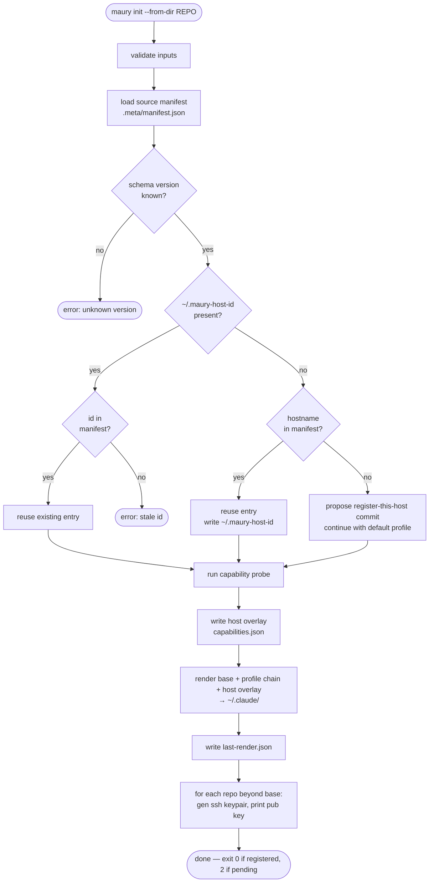
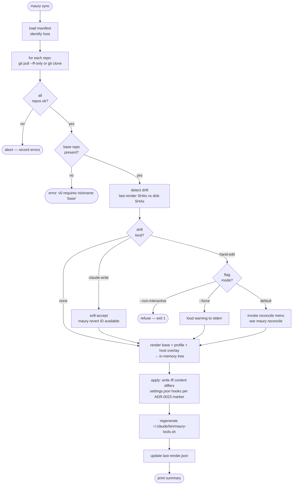
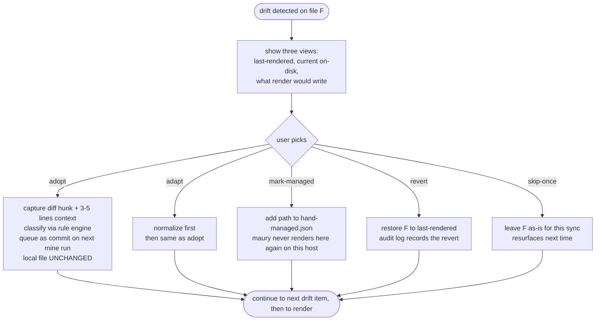
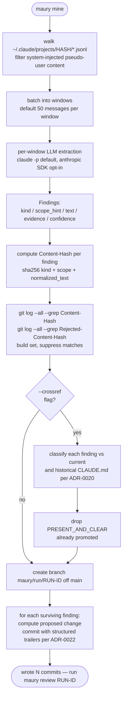
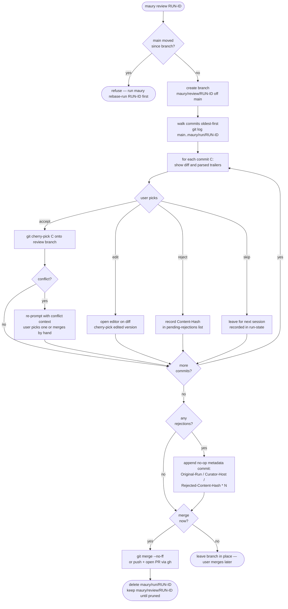
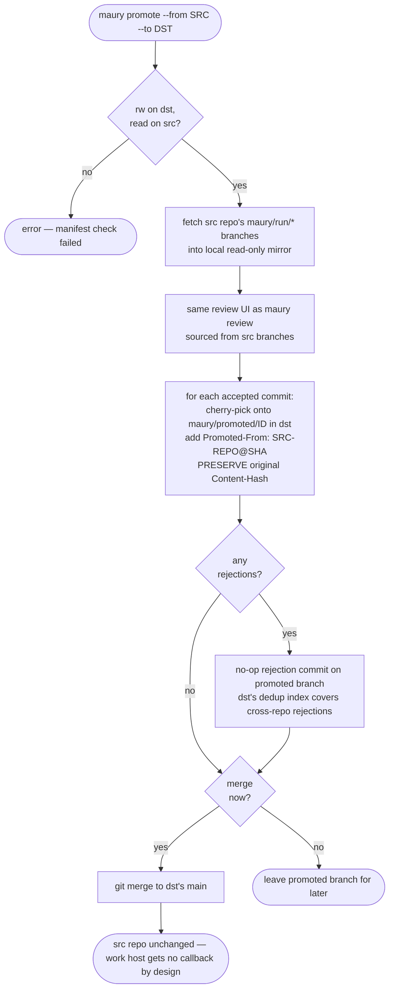
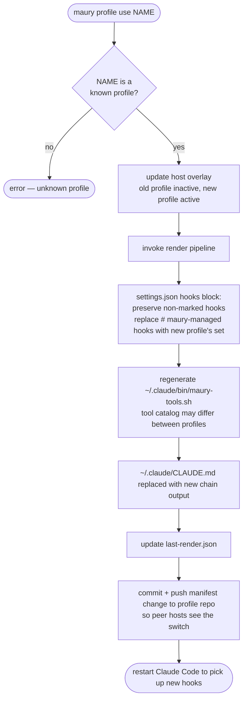
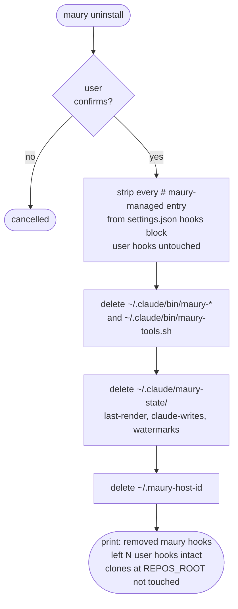

# maury — operations reference

Per-command operational flowcharts. Companion to
[`workflow.md`](workflow.md), which shows the user-journey level;
this file shows what happens *inside* each `maury <command>`.

Diagrams use [mermaid](https://mermaid.js.org/) so they render
cleanly in any modern Markdown viewer (GitHub, GitLab, VS Code,
Obsidian). Terminal viewers fall back to raw mermaid source, which
is still legible for diagnosis.

---

## Index

- [`maury init`](#maury-init)
- [`maury sync`](#maury-sync)
- [`maury reconcile`](#maury-reconcile)
- [`maury mine`](#maury-mine)
- [`maury review <run-id>`](#maury-review-run-id)
- [`maury promote --from --to`](#maury-promote---from---to)
- [`maury profile use <name>`](#maury-profile-use-name)
- [`maury uninstall`](#maury-uninstall)

---

## `maury init`

Bootstrap a host. One-time per host.
See [ADR-0018](adr/0018-minimum-bootstrap-ux.md).

---

## `maury sync`

Daily-driver loop. Pull, drift-check, render, apply.
See [ADR-0017](adr/0017-drift-detection-and-reconciliation.md) for
the drift contract.

---

## `maury reconcile`

Drift menu — invoked inline from `maury sync`, or standalone.
Five actions per ADR-0017 §"The five reconcile actions for hand-edits".

For Claude-write drift, the menu is shorter: default = soft-accept
silently; `revert` available via `maury revert <id>` /
`maury revert --session <sid>` / `maury revert --last`; `promote`
converts the soft-accept into a proposal (same path as `adopt`).

---

## `maury mine`

Local transcript mining per [ADR-0005](adr/0005-local-only-mining.md).
Produces a run branch per [ADR-0022](adr/0022-branch-per-mining-run.md).

---

## `maury review <run-id>`

Walk the run branch's commits with a curator. Per ADR-0022.

---

## `maury promote --from --to`

Cross-repo promotion (e.g., work → base). Curator host has rw on
both. Per [ADR-0009](adr/0009-promotion-only-cross-boundary.md) +
ADR-0022.

---

## `maury profile use <name>`

Switch the host's active profile. Re-renders. Hook teardown is
implicit via the marker scheme.

---

## `maury uninstall`

Clean removal. Reversible up to the point of running it (then
re-run `maury init` to restore). Per ADR-0023 §8.

The pip/uv-installed `maury` CLI itself is not removed; that's a
package-manager operation (`pipx uninstall maury` or
`uv pip uninstall maury`).

---

## What these diagrams don't show

- **Audit log writes** (per Phase 10) — every state-changing branch
  in these flows appends to the local audit log. Omitted from
  every diagram for brevity.
- **Manifest version checks** — every command that loads the
  manifest validates the schema version and refuses unknown
  versions. Implicit in the "load manifest" step.
- **Concurrency** — two `maury sync` invocations on the same host
  racing each other. Not yet designed; documented as a v1.1 gap.
- **Network failures during git ops** — `git pull` / `git clone`
  failures bubble up as errors and are surfaced in the per-repo
  result; the diagrams show only the happy path's downstream steps.
- **Capability-failure render refusal** — per ADR-0006, a hook
  whose required capability is absent causes render to fail loud.
  The diagrams show the success path; failure surfaces as
  "render failed: <reason>" before the apply step.

## Convention

Flowcharts use mermaid `flowchart TD` (top-down). If we ever need
true sequence diagrams (multiple actors over time), use mermaid
`sequenceDiagram` for those — but flowcharts always stay
`flowchart TD` for visual consistency across the project.
