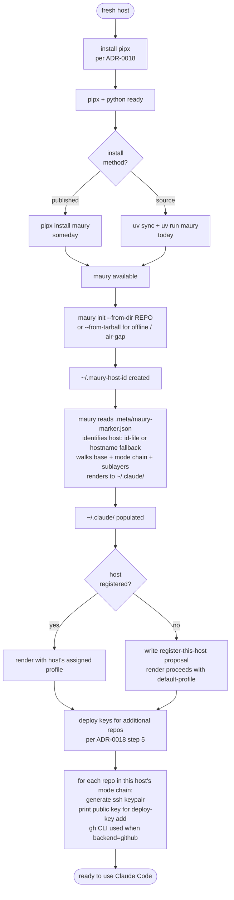
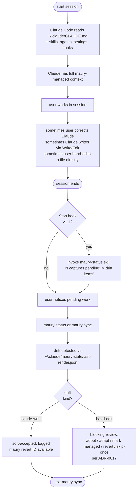
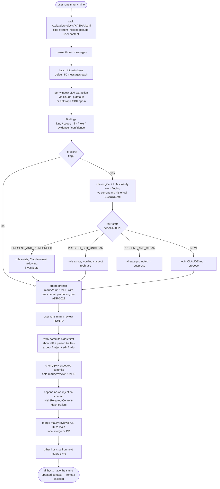
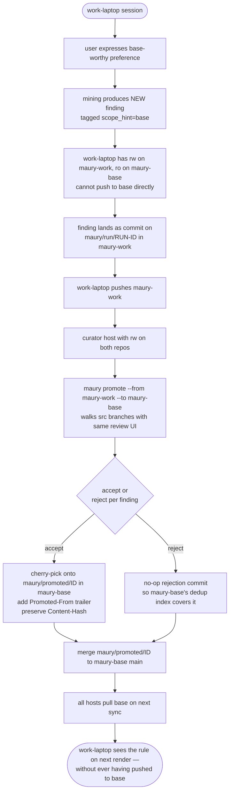

# maury — Claude Code workflow

How a maury-managed Claude Code setup actually flows over time, in
words and diagrams.

The user has three lifecycles to think about:

1. **One-time:** install + bootstrap.
2. **Daily:** Claude Code sessions, with maury keeping config in sync
   and capturing learnings.
3. **Periodic:** mining, review, and promotion of new content into
   the canonical config.

The diagrams below show each. They use [mermaid](https://mermaid.js.org/)
so they render cleanly in any modern Markdown viewer (GitHub, GitLab,
VS Code, Obsidian). Terminal viewers fall back to raw mermaid source.

For per-command operational detail (what happens *inside* each
`maury <command>`), see [`operations.md`](operations.md).

---

## 1. Install + first-run bootstrap (per host)

---

## 2. Daily Claude Code session loop

The skill itself ships in v1; the auto-invocation Stop hook is v1.1.

---

## 3. Periodic mining + cross-reference + review

> The four-state bucket names (`NEW`, `PRESENT_AND_CLEAR`,
> `PRESENT_BUT_UNCLEAR`, `PRESENT_AND_REINFORCED`) shown in the
> diagram below are **owned by [ADR-0020](adr/0020-two-mining-modes-bulk-and-incremental.md)**.
> If those names change there, this diagram becomes stale — that
> ADR is the source of truth.

---

## 4. Cross-host promotion (the ADR-0009 case)

---

## How these tie back to the codebase

| Diagram | Implementing module(s) | Status |
|---|---|---|
| 1. Install + bootstrap | `src/maury/bootstrap/init_cmd.py` | Phase 4 first slice ✅ |
| 2. Daily session loop | `src/maury/render/`, drift detection (Phase 5.x) | render ✅; drift planned |
| 3. Mining + crossref + review | `src/maury/mining/{transcripts,extractor,crossref}.py`; review TBD | extractor + crossref ✅; review Phase 7 |
| 4. Cross-host promotion | promotion module | Phase 9 |

---

## What these diagrams don't show

- **Concurrent access** (two `maury sync` invocations colliding). Not designed yet.
- **The audit log** (Phase 10) — every state-changing event in these diagrams writes an entry.
- **`maury doctor`** ([ADR-0011](adr/0011-anthropic-rubric-integration.md))
  — orthogonal CLAUDE.md health-check evaluating against the Anthropic
  best-practices rubric. User invokes it directly; doesn't fit any of
  these flows.
- **The rule engine** ([ADR-0004](adr/0004-rule-engine-classification.md))
  — implicit in Diagram 3's "four-state buckets" step. The deterministic
  classifier sits between the LLM extractor's output and the proposal
  queue, applying rules from `.meta/rules.yaml`.
- **Active capture** ([ADR-0013](adr/0013-active-in-session-capture.md),
  deferred to v1.1) — would add a "user-in-session ↔ maury-stage skill
  ↔ staging file" loop inside Diagram 2.
- **Secrets** ([ADR-0014](adr/0014-host-local-secrets-with-metadata-sync.md),
  deferred to v1.1) — orthogonal to these flows.
